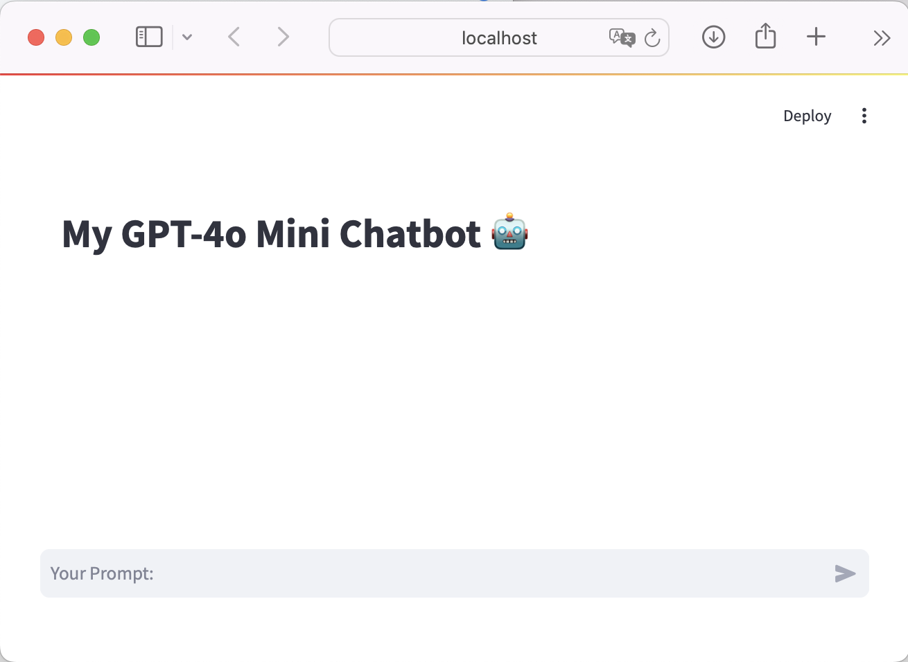
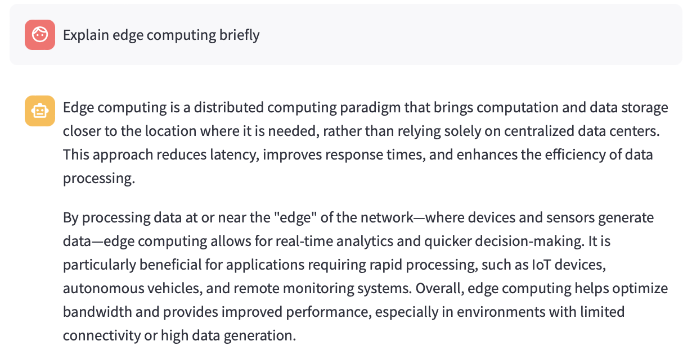
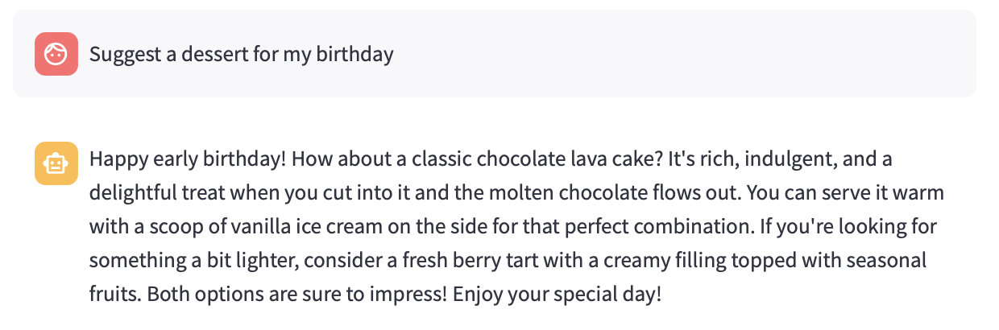
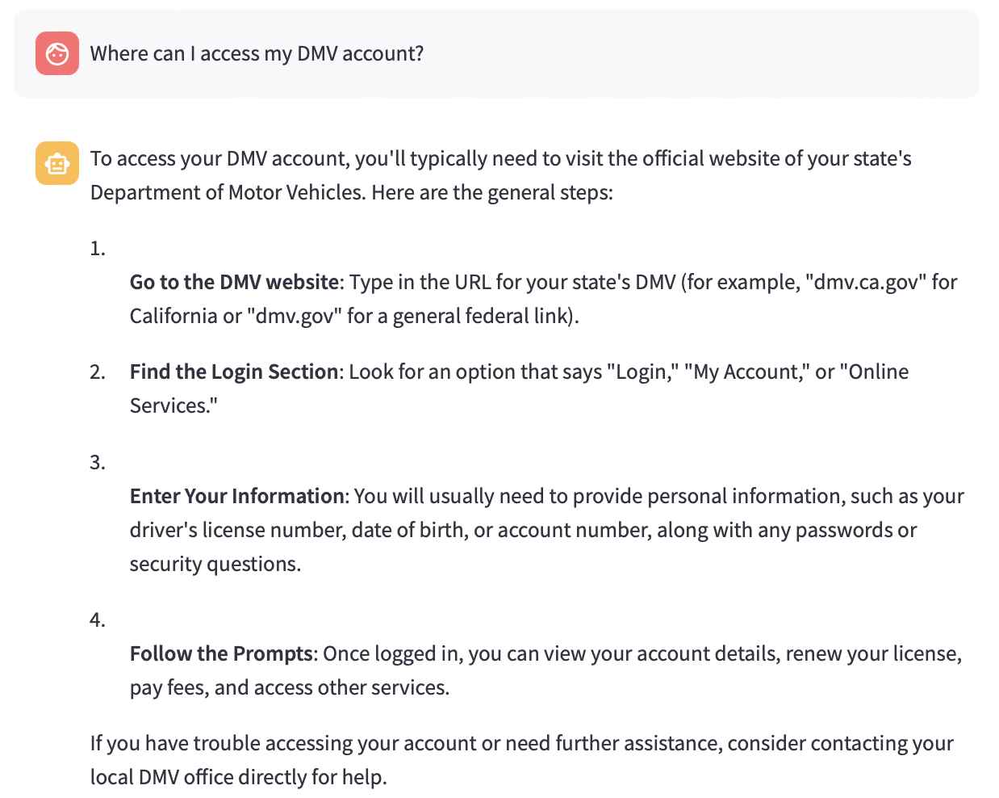

# OpenAI Chatbot with GPT-4o Mini & Streamlit

This project implements a chatbot using the OpenAI GPT-4o Mini model, providing an interactive web interface via Streamlit. The chatbot leverages the OpenAI API to deliver natural language processing (NLP) capabilities for versatile text generation and conversation.

## Features
- **Streamlit UI**: An interactive web interface for the chatbot.
- **OpenAI API Integration**: Utilizes the OpenAI API to access AI models and generate responses.
- **Lightweight GPT-4o Mini**: Uses a faster and more cost-effective version of the GPT-4o model.
- **Python Implementation**: Built with Python and supported libraries for easy deployment.

## Project Design
- **Streamlit**: An open-source app framework for data science to build interactive web applications.
- **OpenAI API**: Provides access to state-of-the-art AI models for text generation, including parameters such as roles, tokens, temperature, and streaming.
- **GPT-4o Mini Model**: A lightweight variant of GPT-4o that is optimized for speed and cost efficiency.
- **Python**: Core implementation using Python with the OpenAI library, Streamlit, Python Dotenv, and Tiktoken.

## Installation

### Prepare the Environment
1. Install Python.
2. Create an OpenAI API key [here](https://platform.openai.com/api-keys).
3. Set up a `.env` file to store the API key securely.

### Install Required Packages
Run the following command to install the necessary dependencies:
```sh
pip install openai streamlit python-dotenv tiktoken
```

## Usage

### Build the Chatbot
1. **Load Environment Variables**: Use `load_dotenv()` to load the API key.
2. **Initialize OpenAI Client**: `client = OpenAI()`.
3. **Create the UI**: Use Streamlit to build the chatbot interface.
4. **Model Integration**: Utilize GPT-4o Mini for text generation and response.

### Run the Application
Use the following command to run the chatbot:
```sh
streamlit run chatbot.py
```

## Web Interface
The chatbot runs on a Streamlit-based web interface, providing an intuitive UI to interact with the model in real-time. Messages are streamed out to simulate a typing experience.



## Sample Use Cases
- **Learning Assistant**: Offer explanations and tutorials on specific topics.
  
- **Personal Companion**: Engage in casual conversations.
  
- **Customer Support**: Provide answers to common queries in a human-like conversational manner.
  

## Repository Link
You can access the full codebase on GitHub: [GenerativeAI - Chatbot with GPT-4o Mini and Streamlit](https://github.com/bigfishhhhhzoey/GenerativeAI/tree/main/Chatbot%20with%20got-4o-mini%20and%20Streamlit).

## Google Slides
You can access the presentation on Google Slides: [OpenAI Chatbot Implementation with GPT-4o Mini & Streamlit](https://docs.google.com/presentation/d/1nzKXdxTmdOcXTqsovh9xYfslPyJc6jG6hPX_xBCqUxw/edit?usp=sharing).
