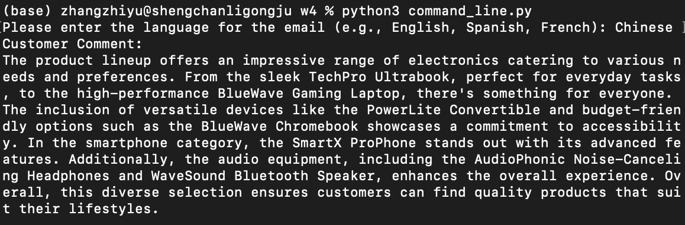
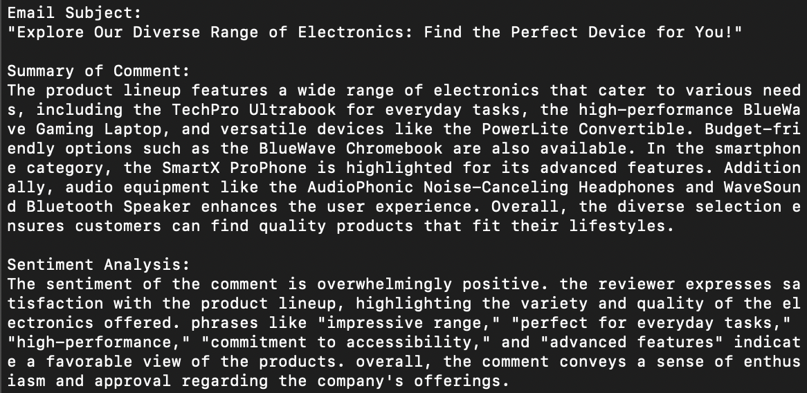
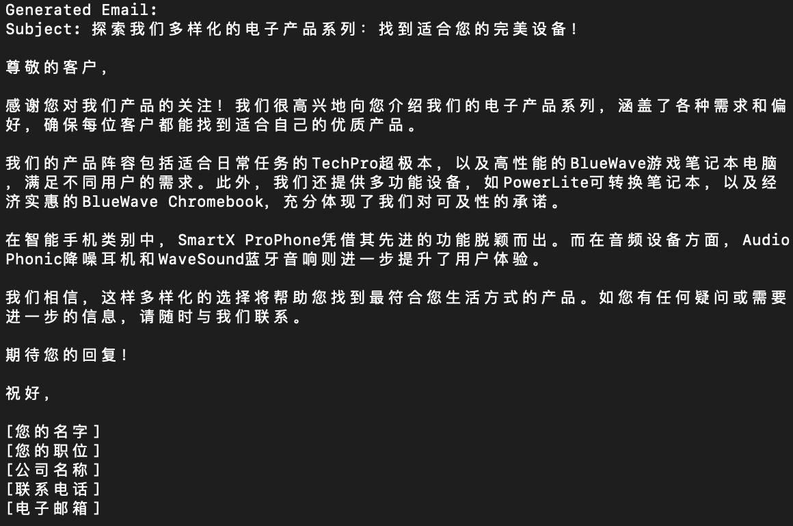
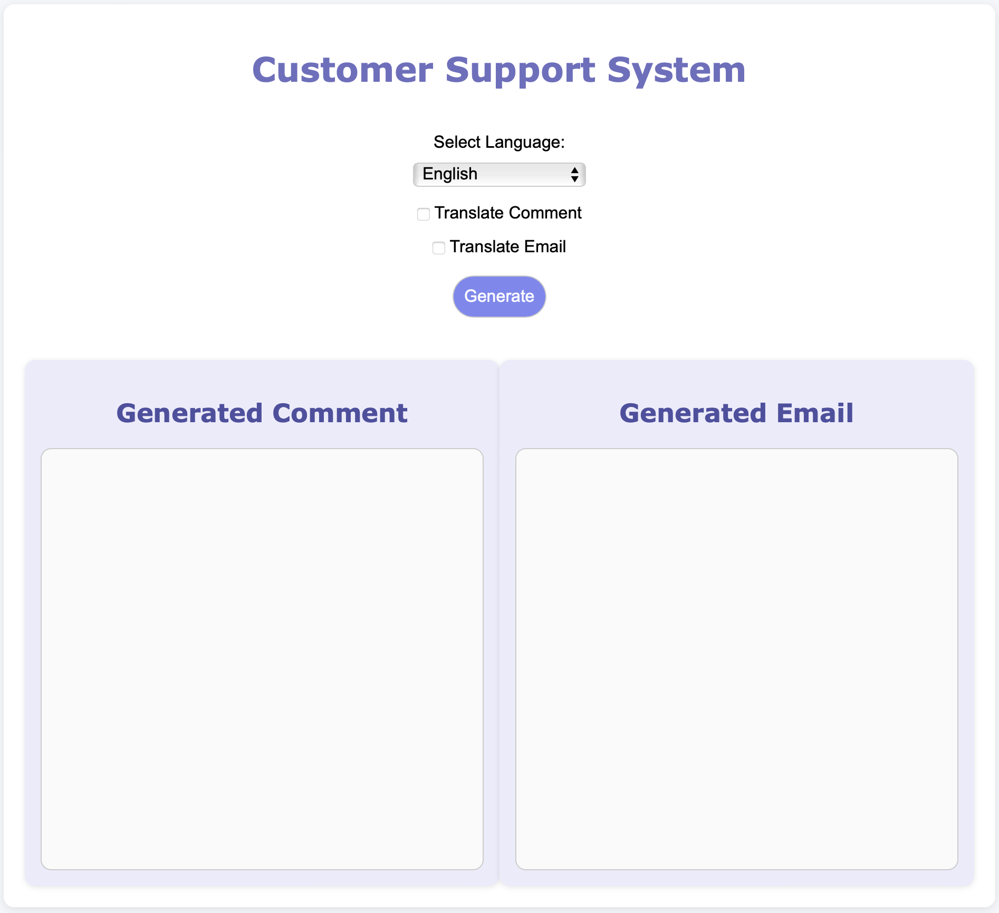
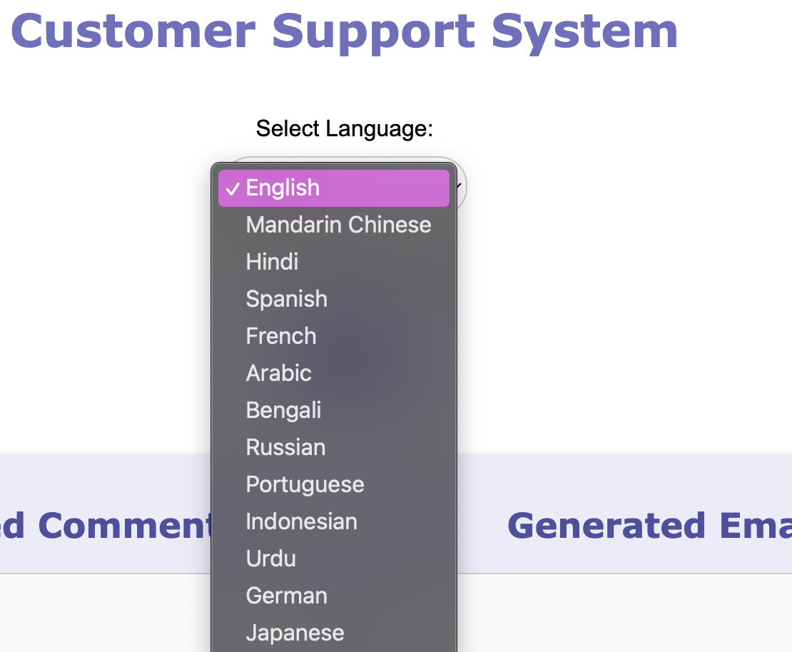
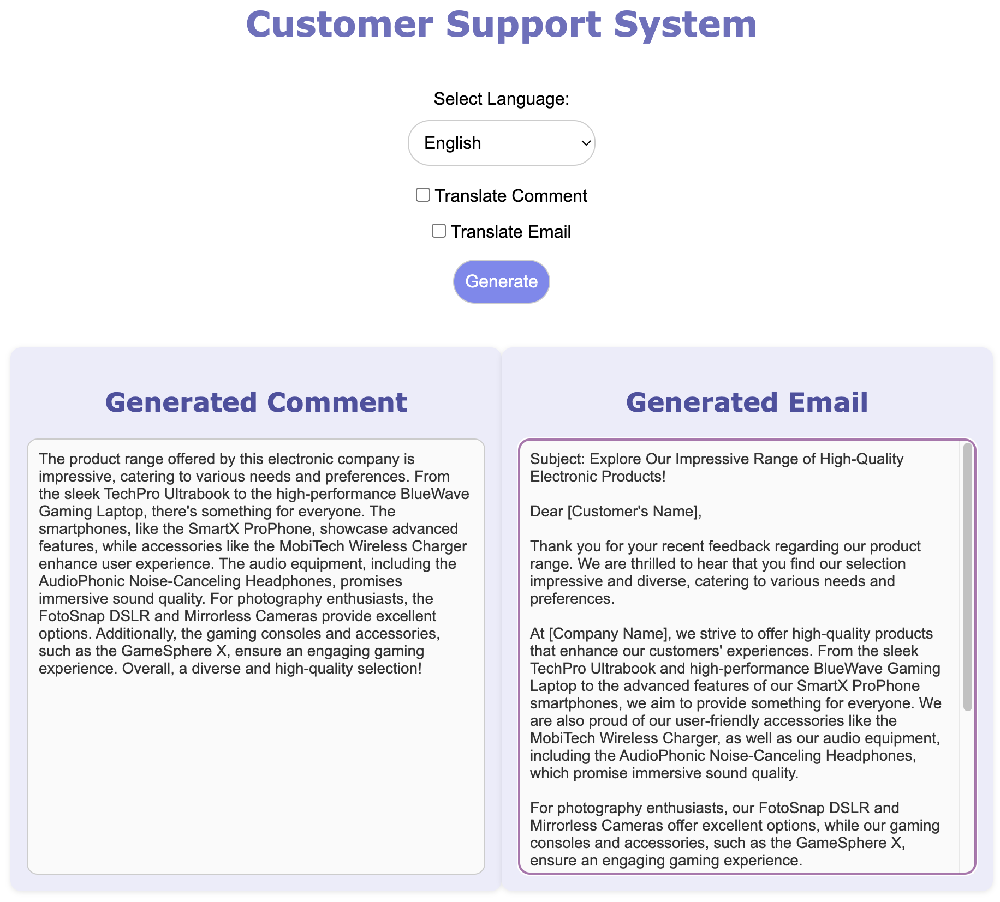
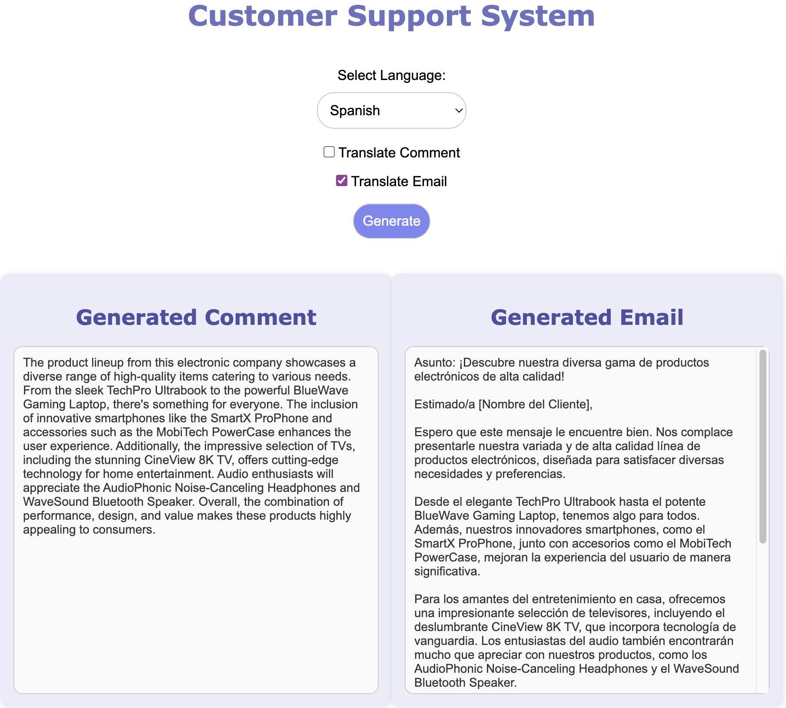
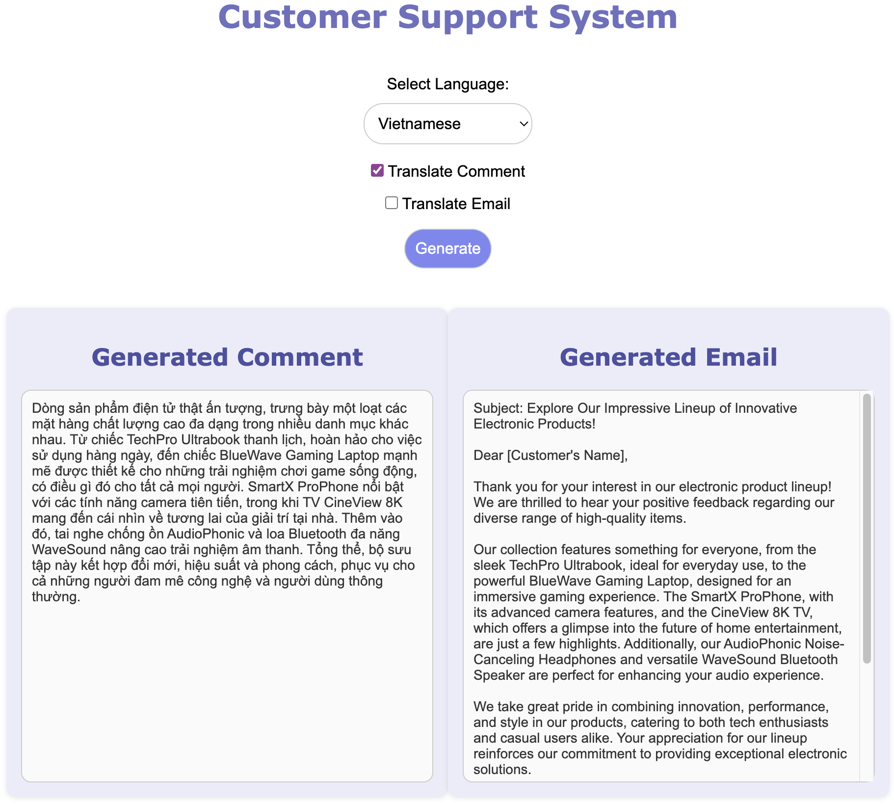
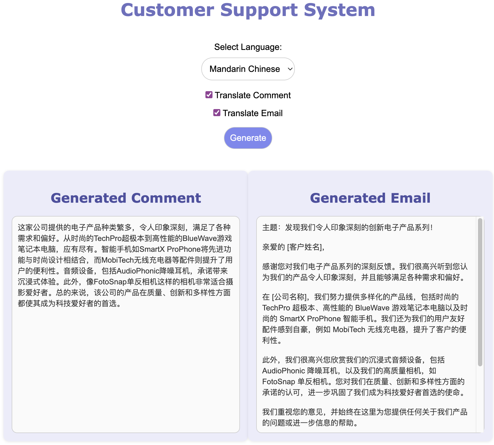

# Customer Support Automation with GPT-based Models

This project is a **Customer Support System** designed for a large electronics store. It leverages GPT-based models to generate customer comments and corresponding email responses. The app supports multi-language capabilities, allowing users to translate comments and emails into the top 30 most popular languages worldwide.

## Features

- **Automated Customer Comment Generation**: Simulate customer feedback by generating comments about products.
- **Email Response Generation**: Create professional email responses to customer comments.
- **Multi-language Support**: Translate comments and emails into 30 popular languages.
- **Interactive Web Interface**: User-friendly web app with a responsive design.
- **Retained User Inputs**: Form inputs remain after submission for better user experience.
- **Customizable Design**: Aesthetic inspired by the Morandi color palette with options for further customization.

## Project Design

### Overview

The project is designed to automate customer support interactions by simulating both sides of the communication—the customer comment and the support email response. The core of the application revolves around leveraging GPT-based language models to generate coherent and contextually relevant text.

### Architecture

- **Frontend**: A Flask web application serves as the user interface, allowing users to select options and view results.
- **Backend**: Python functions handle the logic for generating comments, analyzing sentiment, and creating email responses.
- **API Integration**: OpenAI's API is used to interact with the GPT-4 language model for text generation tasks.

### Flow of Data

1. **User Input**: The user selects a language and translation options on the web interface.
2. **Comment Generation**: The app generates a customer comment about a product using GPT.
3. **Email Generation**: An email response is generated based on the comment using the following steps:
   - generate email subject according to the comment
   - generate the summary of customer's comment
   - sentiment analysis of the customer's comment
   - generate an email to be sent to the customer
5. **Translation**: If selected, the comment and/or email are translated into the chosen language.
6. **Display Results**: The generated texts are displayed side by side on the web page.

### Error Handling

- **API Failures**: The app includes basic error handling to manage API exceptions, providing user-friendly messages.
- **Input Validation**: Form inputs are validated to prevent incorrect or malicious data from causing issues.

## Tech Stack

- **Flask**: Serves as the web framework for the application.
- **OpenAI API**: Utilized for generating text via the `gpt-4o-mini` model.
- **HTML/CSS**: Crafts the frontend interface with responsive design principles.
- **Python-dotenv**: Manages environment variables securely.
- **Bootstrap-inspired Styling**: Enhances UI elements for better aesthetics and responsiveness.

## Installation

To get started with this project, follow these steps:

1. **Clone this repository**:

   ```bash
   git clone https://github.com/yourusername/customer-support-automation.git
   ```

2. **Navigate into the project directory**:

   ```bash
   cd customer-support-automation
   ```

3. **Create a virtual environment**:

   ```bash
   python3 -m venv venv
   ```

4. **Activate the virtual environment**:

   - On macOS/Linux:

     ```bash
     source venv/bin/activate
     ```

   - On Windows:

     ```bash
     venv\Scripts\activate
     ```

5. **Install the required dependencies**:

   ```bash
   pip install -r requirements.txt
   ```

6. **Set up your `.env` file with your OpenAI API key**:

   ```bash
   OPENAI_API_KEY=your_openai_api_key
   ```

7. **Run the Flask app**:

   ```bash
   flask run
   ```

8. **Open your browser** and visit `http://127.0.0.1:5000` to access the web interface.

## Usage

1. **Language Selection**: Choose a language from the dropdown menu.

2. **Translation Options**: Select whether to translate the customer comment and/or email into the chosen language.

3. **Generate**: Click "Generate" to produce the customer comment and email.

4. **View Results**: The generated comment and email are displayed side by side. The form retains your selections for convenience.

## Command Line Execution
- **Generate the Comment**:



- **Analyse the Comment**:
  


- **Generate the Email**:
  


## Web Interface
The web interface provides an intuitive platform for users to generate and view customer comments and email responses. It features a clean layout with input options and displays the results side by side for easy comparison.



## Language Selection
Users can select from the top 30 most popular languages worldwide via a dropdown menu, enabling the application to cater to a global audience.



## Sample Use Cases
Here are some sample use cases demonstrating the application's versatility in handling different languages and translation options:
- **English to English**: Generating both the comment and email in English without translation.



- **English to Spanish**: Generating the comment in English and translating the email to Spanish.



- **Vietnamese to English**: Generating the comment in Vietnamese and the email in English.



- **Chinese to Chinese**: Generating both the comment and email in Chinese.



## Repository Link
You can access the full codebase on GitHub: [Customer Support Email Generator](https://github.com/bigfishhhhhzoey/GenerativeAI/tree/main/Customer%20Support%20Email%20Generator).

## Google Slides
You can access the presentation on Google Slides: [Customer Support Email Generator](https://docs.google.com/presentation/d/19wb7PAvCZryy7h71Vm1rI6dMmcIoxuoWxjKitMBSJls/edit?usp=sharing).

