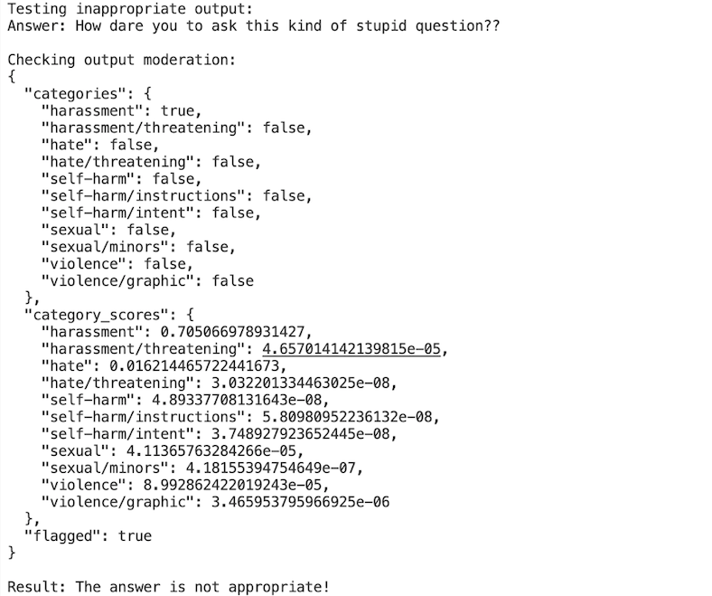

# Customer Support System: Moderation, Classification, Checkout, and Evaluation

This project is an extension of a **Customer Comment and Response Generator** app that now incorporates robust features like **moderation**, **classification**, **sentiment analysis**, **prompt injection prevention**, **chatbot response generation**, **output moderation**, and **response evaluation**. The system offers a streamlined experience for users through both a command-line interface and a Flask-based web interface.

## 1. Prerequisite App

### [Customer Comment and Response Generator](https://github.com/bigfishhhhhzoey/GenerativeAI/tree/main/Customer%20Support%20Email%20Generator/)

The previous **Customer Comment and Response Generator** app was designed to generate customer comments and email responses based on product information. It allowed users to interact with an AI model to generate feedback on electronic products. This system included:
- A user-friendly input system for providing product data
- Generation of customer comments and email subjects based on that data
- Sentiment analysis of customer comments

You can explore the app [here](https://github.com/bigfishhhhhzoey/GenerativeAI/tree/main/Customer%20Support%20Email%20Generator/).

---

## 2. Project Design

### Customer Support System: Moderation, Classification, Checkout, and Evaluation

This project introduces several new features to enhance the robustness of the customer support system. Here’s a breakdown of the new functionalities:

### Features

1. **Moderation**: Ensures that input and output are appropriate and safe for processing. It flags inappropriate language in customer comments or responses.
2. **Prompt Injection Prevention**: Detects potential prompt injection attacks in user inputs and halts execution to prevent malicious exploitation.
3. **Sentiment Analysis**: Analyzes the sentiment of customer comments to help understand the emotional tone of the feedback.
4. **Chatbot Response Generation**: Generates contextually appropriate and helpful chatbot responses based on the analyzed comment.
5. **Output Moderation**: After generating a chatbot response, this function checks if the output is appropriate.
6. **Evaluation**: This feature evaluates the chatbot’s response to ensure it is factually correct and satisfies the customer’s query.
7. **Language Support**: The system supports 30 of the most commonly spoken languages for both input comment generation and chatbot responses.

---

## 3. Test Cases

Here are some test cases with expected outputs, which were used to test the core functionality of this app.

### Input Moderation:
For a benign comment, the system should not flag anything, but for inappropriate comments, it should detect and prevent further action.


### Prompt Injection Prevention:
The system should recognize common prompt injection attempts and flag them appropriately.


### Classification:
Proper classification of customer support queries (e.g., "delete my profile" classified as "Account Management").


### Chain of Thoughts Reasoning:


### Output Moderation: 
After generating a chatbot response, this function checks if the output is appropriate.




### Output Self-Evaluation:


### Evaluation for Question with Single Right Answer


### Evaluation for Question with Multiple Right Answers

#### Evalution with Rubric


#### Evalution with Ideal Answers


---

## 4. Command-Line Application

The command-line application combines the features of the original customer comment and response generator with the newly added moderation, classification, and evaluation functionalities. 

### System Workflow:

1. **Generate Comments**: Users can choose to generate customer comments in one of 30 languages.
2. **Input Moderation**: The system first checks for any inappropriate or flagged content in the input.
3. **Prompt Injection Prevention**: Next, it scans for any malicious prompt injection attempts.
4. **Sentiment Analysis**: Sentiment analysis is performed on the input to understand the emotional context.
5. **Chatbot Response Generation**: A chatbot response is generated based on the sentiment and input.
6. **Output Moderation**: The response is checked to ensure it does not contain inappropriate or harmful content.
7. **Evaluation**: Finally, the response is evaluated for accuracy and completeness.

### To Run:

```bash
python3 command_line.py
```

### Sample Use Cases:

- **Input Moderation**:
  
- **Prompt Injection Prevention**: The system performs input moderation and checks for prompt injection.
  
- **Appropriate Input and Response**: The application analyzes the sentiment of the comment and generates an appropriate chatbot response.

---

## 5. Flask Web App

The Flask web application provides a user-friendly interface for interacting with the customer support system.

### Features:
- **Comment Input**: Users can either input their own comments or generate a comment in their preferred language (from the top 30 languages).
- **Language Selection**: Both the comment and chatbot response can be generated in one of 30 commonly spoken languages.
- **Moderation and Prompt Injection**: The app checks for inappropriate content or prompt injection attempts before processing the input.
- **Sentiment Analysis and Response**: Once the comment passes moderation, the system generates a chatbot response based on the sentiment analysis.
- **Output Moderation and Evaluation**: The system checks the response for appropriateness and evaluates its accuracy.
- **Go Back Option**: Users can review the generated responses and then go back to the main page to input new comments.

### To Run the Flask App:

1. Install dependencies:
   ```bash
   pip install flask python-dotenv openai
   ```

2. Run the Flask app:
   ```bash
   flask run
   ```

3. Access the app at `http://127.0.0.1:5000/` in your browser.

### Flask Web App Interface:

- **Step-by-Step Interaction**: Each step of the process (input moderation, sentiment analysis, response generation, etc.) is shown to the user with clear feedback.
- **Go Back Button**: After viewing the results, users can return to the home page to try new comments.

### Sample Use Cases:


---

## Repository Link
You can access the full codebase on GitHub: [Customer Support System: Moderation + Classification + Checkout + Evaluation](https://github.com/bigfishhhhhzoey/GenerativeAI/tree/main/Customer%20Support%20System%3A%20Moderation%20%2B%20Classification%20%2B%20Checkout%20%2B%20Evaluation).

## Google Slides
You can access the presentation on Google Slides: [Customer Support System: Moderation, Classification, Checkout, Evaluation](https://docs.google.com/presentation/d/1aNkuirDzg4_AexxwBFSkM9xpe6tSp32pVLcn5gMjke0/edit?usp=sharing).
