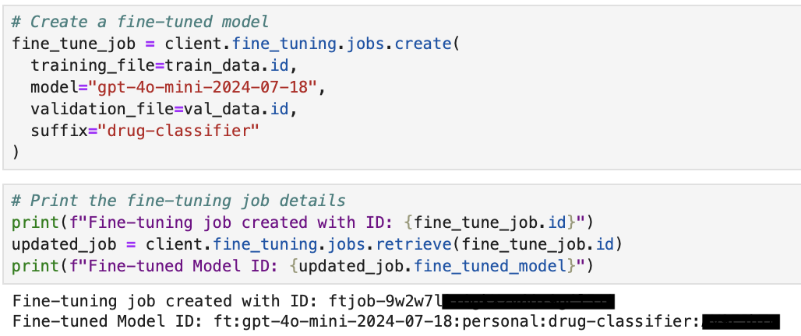
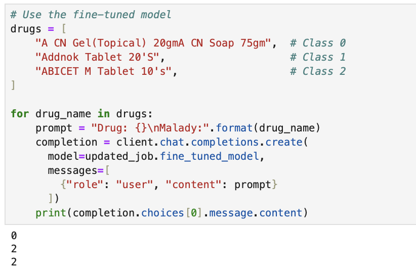
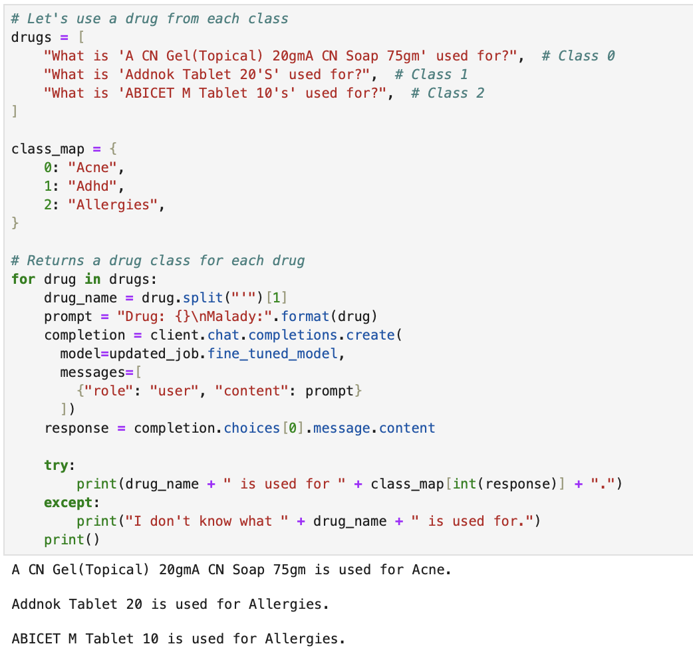

# Drug Classification Fine-Tuning Project

## Project Description

This project demonstrates how to fine-tune an OpenAI GPT-based model to classify drugs into specific medical categories based on their names and usage, using data from an Excel file (`Medicine_description.xlsx`). The fine-tuned model predicts the associated medical condition (e.g., Acne, ADHD, Allergies) efficiently, automating drug classification tasks. To balance cost and performance, we used **`gpt-4o-mini-2024-07-18`** as the base model, achieving accurate results while maintaining affordability.

## Key Features
1. **Data Preparation**:
   - Convert drug classification data from an Excel file (`Medicine_description.xlsx`) into a JSONL format suitable for fine-tuning.
   - Create both training and validation datasets for fine-tuning.

2. **Fine-Tuning**:
   - Fine-tune a GPT-based model using OpenAI's Python API.
   - Include a descriptive suffix (`drug-classifier`) for the fine-tuned model.

3. **Prediction and Testing**:
   - Use the fine-tuned model to classify drugs into predefined classes.
   - Map numerical classifications to human-readable malady names.

4. **Improved Workflow**:
   - Data preparation, training, and testing are all implemented in Python, ensuring compatibility with the latest OpenAI SDK versions.
   - Functions and processes have been optimized for clarity and usability.

## Workflow

### Step 1: Data Preparation
1. Load data from `Medicine_description.xlsx`, which contains columns:
   - **Drug_Name**: The name of the drug.
   - **Reason**: The medical condition associated with the drug.
   - **Description**: Additional information (not used for fine-tuning).

   ```python
   import pandas as pd
   import json
   from sklearn.model_selection import train_test_split
   
   # Load the first n rows of data from the Excel file
   n = 2000
   df = pd.read_excel('Medicine_description.xlsx', sheet_name='Sheet1', header=0, nrows=n)
   
   # Get unique values in the 'Reason' column and assign numerical indices
   reasons = df["Reason"].unique()
   reasons_dict = {reason: i for i, reason in enumerate(reasons)}
   
   # Format the 'Drug_Name' column for prompt content
   df["Drug_Name"] = "Drug: " + df["Drug_Name"] + "\n" + "Malady:"
   
   # Replace 'Reason' column values with their numerical mappings
   df["Reason"] = df["Reason"].apply(lambda x: str(reasons_dict[x]))
   
   # Drop the 'Description' column
   df.drop(["Description"], axis=1, inplace=True)
   ```

2. Split the data into training and validation datasets (80% training, 20% validation).
   ```python
   # Split the data into training and validation datasets
   train_df, val_df = train_test_split(df, test_size=0.2, random_state=42)
   ```
    
3. Convert the data into a JSONL format with the updated message-based structure:

   **Example Format**:
   ```json
   {
     "messages": [
       {"role": "system", "content": "You are a drug classification assistant."},
       {"role": "user", "content": "Drug: A CN Gel(Topical) 20gmA CN Soap 75gm\nMalady:"},
       {"role": "assistant", "content": "0"}
     ]
   }
   ```
   ```python
   # Function to convert DataFrame into JSONL format
   def convert_to_jsonl(df, output_file):
       output = []
       system_message = {"role": "system", "content": "You are a drug classification assistant."}
    
       for _, row in df.iterrows():
           user_message = {"role": "user", "content": row["Drug_Name"]}
           assistant_message = {"role": "assistant", "content": row["Reason"]}
           output.append({"messages": [system_message, user_message, assistant_message]})
       
       with open(output_file, "w") as f:
           for entry in output:
               f.write(json.dumps(entry) + "\n")
   ```

4. Save the datasets as `train_data.jsonl` and `val_data.jsonl`.
   ```python
   # Save the training and validation datasets to JSONL files
   convert_to_jsonl(train_df, "train_data.jsonl")
   convert_to_jsonl(val_df, "val_data.jsonl")
   ```

### Step 2: Fine-Tuning
1. Load OpenAI API Configuration:
   ```python
   import os
   from dotenv import load_dotenv
   from openai import OpenAI

   # Load API key from .env file
   load_dotenv()
   client = OpenAI(api_key=os.getenv("OPENAI_API_KEY"))
   ```

2. Upload the training and validation datasets:
   ```python
   train_data = client.files.create(file=open("train_data.jsonl", "rb"), purpose="fine-tune")
   val_data = client.files.create(file=open("val_data.jsonl", "rb"), purpose="fine-tune")
   ```

3. Fine-tune the model:
   ```python
   fine_tune_job = client.fine_tuning.jobs.create(
       training_file=train_data.id,
       model="gpt-4o-mini-2024-07-18",
       validation_file=val_data.id,
       suffix="drug-classifier"
   )

   # Print the fine-tuning job details
   print(f"Fine-tuning job created with ID: {fine_tune_job.id}")
   ```

4. Monitor the fine-tuning job:
   ```python
   updated_job = client.fine_tuning.jobs.retrieve(fine_tune_job.id)
   ```

5. Once the fine-tuning job is completed successfully, retrieve the fine-tuned model ID:
   ```python
   print(f"Fine-tuned Model ID: {updated_job.fine_tuned_model}")
   ```
   

6. **Training Details**:
   - **Number of Data Entries**: 2000
   - **Training Time**: ~43 minutes
   - **Cost**: $0.58

### Step 3: Testing the Fine-Tuned Model
1. Prepare test drug names:
   ```python
   drugs = [
       "A CN Gel(Topical) 20gmA CN Soap 75gm",  # Class 0
       "Addnok Tablet 20'S",                    # Class 1
       "ABICET M Tablet 10's",                  # Class 2
   ]
   ```

2. Use the fine-tuned model to classify drugs:
   ```python
   for drug_name in drugs:
       prompt = f"Drug: {drug_name}\nMalady:"
       completion = client.chat.completions.create(
           model=updated_job.fine_tuned_model,
           messages=[{"role": "user", "content": prompt}]
       )
       response = completion.choices[0].message.content
       print(completion.choices[0].message.content)
   ```

3. Map numerical classes to malady names for readability:
   ```python
   class_map = {0: "Acne", 1: "ADHD", 2: "Allergies"}
   for drug_name in drugs:
       prompt = f"Drug: {drug_name}\nMalady:"
       completion = client.chat.completions.create(
           model=updated_job.fine_tuned_model,
           messages=[{"role": "user", "content": prompt}]
       )
       response = completion.choices[0].message.content
       try:
           print(drug_name + " is used for " + class_map[int(response)] + ".")
       except:
           print("I don't know what " + drug_name + " is used for.")
       print()
   ```

## Improvements Made
1. **Updated Data Template**:
   - Transitioned from older prompt-completion format to the newer `messages` structure, compatible with OpenAI's latest models.
   
2. **Manual Data Splitting**:
   - Split the dataset into training and validation files using Python (`train_test_split`).

3. **Complete Python Workflow**:
   - Replaced CLI commands with Python code for uploading, training, and testing, ensuring compatibility with the OpenAI Python SDK.

4. **Enhanced Readability**:
   - Improved testing outputs by mapping numerical classes to descriptive malady names.
   - Cleaned up drug names during testing for better presentation.

5. **Efficiency**:
   - Processed 2000 data entries in ~43 minutes for $0.58, demonstrating cost-effective and efficient fine-tuning.

## How to Run the Project
1. Install the necessary libraries:
   ```bash
   pip install pandas scikit-learn openai python-dotenv
   ```

2. Prepare the `.env` file with your OpenAI API key:
   ```
   OPENAI_API_KEY=your_openai_api_key
   ```

3. Run the script:
   ```bash
   python3 fine_tuning.py
   ```

## Testing Results



## Limitations
- The model's accuracy depends on the quality and size of the training dataset.
- Unseen drugs or ambiguous inputs might lead to incorrect classifications or failures.

## Repository Link
You can access the full codebase on GitHub: [Fine-tuning Drug Classification](https://github.com/bigfishhhhhzoey/GenerativeAI/tree/main/Fine-tuning%20Drug%20Classification).

## Google Slides
You can access the presentation on Google Slides: [Fine-tuning: Drug Classification](https://docs.google.com/presentation/d/1EgYljWw6iEYHg8lR3-3W2FA5FesdJXS8nQbAC4IvqDI/edit?usp=sharing).
