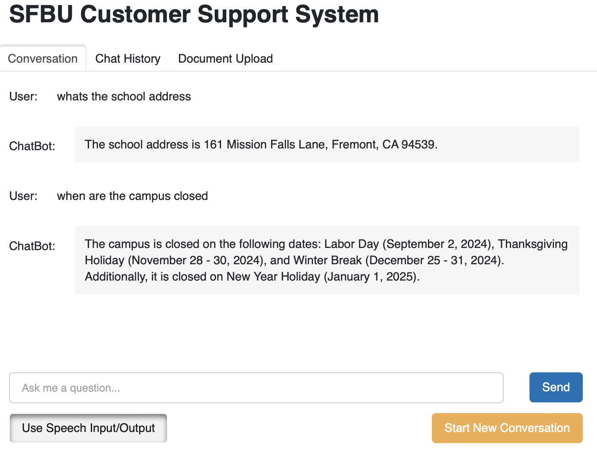
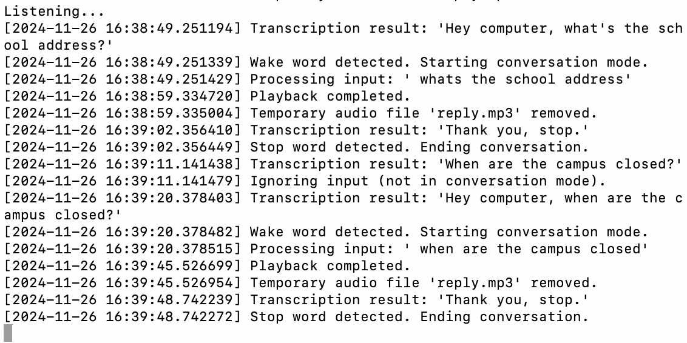
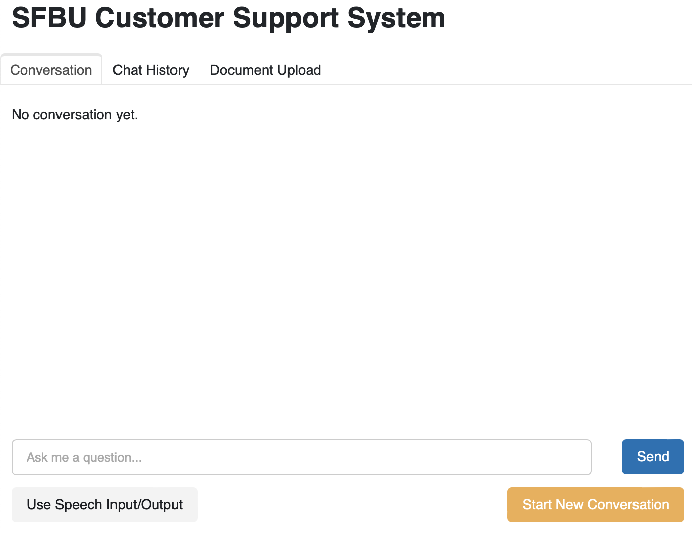
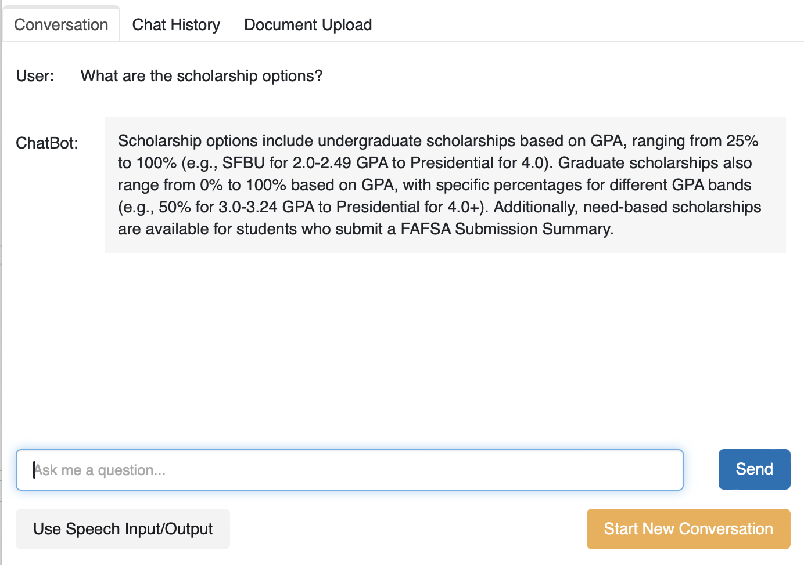
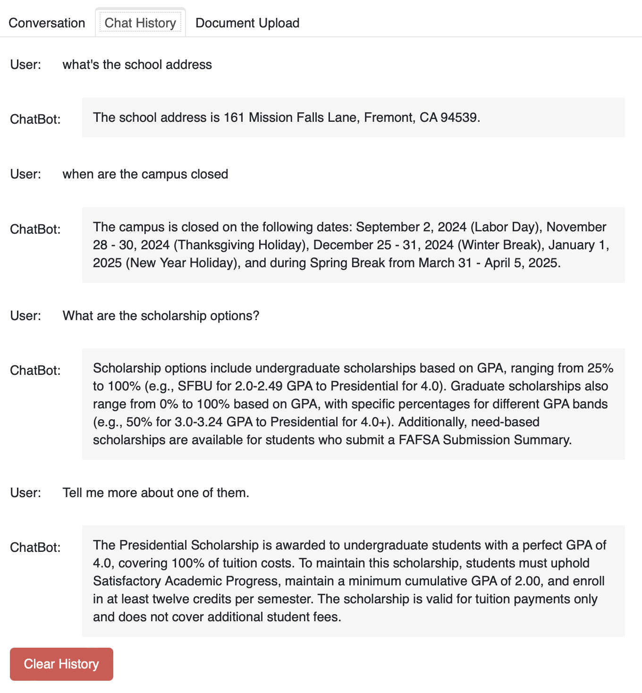
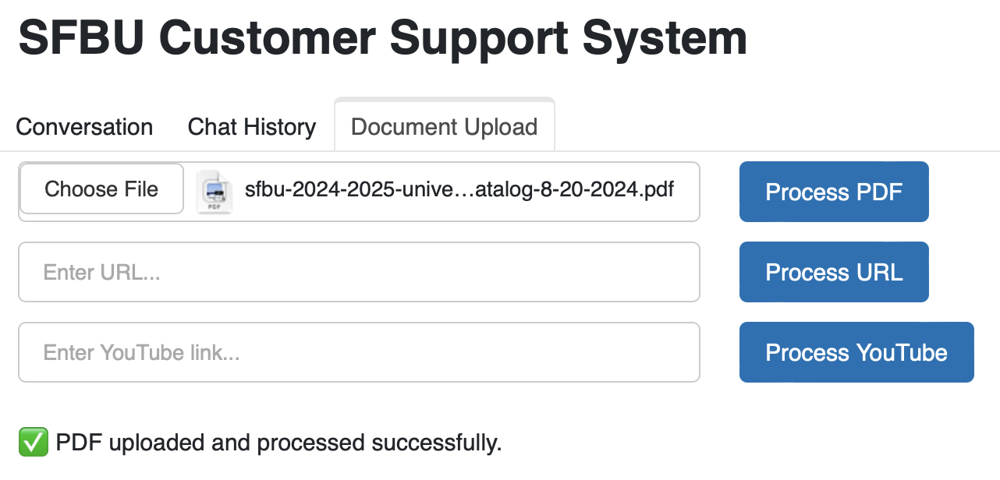
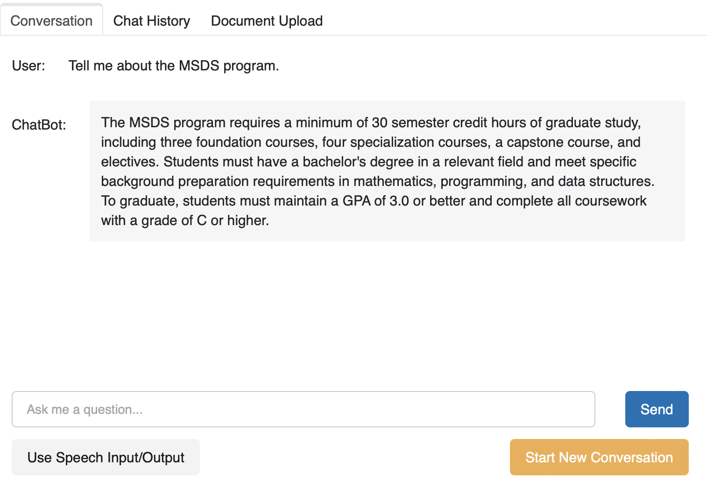

# SFBU Customer Support System with Speech Integration

## Project Overview

This project builds upon the [document-based chatbot with RAG and conversational memory](https://github.com/bigfishhhhhzoey/GenerativeAI/tree/main/SFBU%20Customer%20Support%20System%20-%20Text) by integrating speech input and output capabilities. It allows users to interact with the chatbot using both text and voice, enhancing accessibility and user experience. The system uses **OpenAI's Whisper API** for speech-to-text, **GPT-4o-mini** for text generation, and **OpenAI's TTS API** for text-to-speech responses. The conversational context is preserved using a sophisticated RAG-based retrieval mechanism.

## Key Features

1. **Multimodal Interaction**: Supports both text and voice inputs/outputs.
   - **Speech Recognition**: Users can speak queries, which are transcribed using Whisper API.
   - **Text Generation**: GPT-4o-mini provides concise and contextually accurate responses.
   - **Speech Synthesis**: Responses are read aloud using OpenAI's TTS, making it suitable for hands-free operation.

2. **Document Retrieval with RAG**: Users can upload documents (PDFs, web links, YouTube videos), and the chatbot answers questions based on relevant content retrieved from these documents. The RAG workflow ensures that responses are context-aware.

3. **Advanced Conversational Memory**: Implements a history-aware retriever and conversational retrieval chain to provide meaningful follow-up answers, preserving conversation flow.

4. **User-Friendly Web Interface**: Uses Panel for building an interactive UI, featuring document upload, real-time responses, speech toggle, and conversation history management.

5. **State Management & Robust Handling**: Uses `StateGraph` for managing conversational flow, `MemorySaver` for chat history, and `State` schema to keep track of inputs, context, and responses.

## Project Workflow

1. **RAG and VectorDB Creation**:
   - **Load Documents**: Supports PDFs, web pages, and YouTube videos.
   - **Vector Database**: Stores document embeddings using Chroma for efficient retrieval.

2. **Conversational QA Chain**:
   - **Contextual Retriever**: Handles user follow-ups by understanding context from prior questions.
   - **Concise Answers**: Uses a system prompt to ensure concise and informative responses.

3. **Speech I/O Integration**:
   - **Speech Input**: Uses Whisper API for converting voice queries into text.
   - **Speech Output**: Text responses are read aloud using OpenAI's TTS for accessibility.

4. **Web Interface**:
   - **Document Upload**: Users can upload documents through the UI.
   - **Conversation Management**: Tabs for conversation, chat history, and document upload.
   - **Speech Toggle**: Allows users to choose between text and speech interaction.

## How to Run the Project

1. **Set up your `.env` file** with your OpenAI API key:
   ```
   OPENAI_API_KEY=your_openai_api_key
   ```

2. **Run the chatbot interface**:
   ```bash
   panel serve chatbot.py --autoreload
   ```

## Using the Web Interface

- **Conversation Tab**:
  - Type or speak queries using the provided input options.
  - Toggle speech interaction using the **Use Speech Input/Output** button.
  - Start a new conversation to reset the current discussion without clearing the overall chat history.

- **Chat History Tab**:
  - View all previous conversations.
  - Clear all stored conversations using the **Clear History** button.

- **Document Upload Tab**:
  - Upload documents (PDFs, URLs, YouTube links) to allow the chatbot to answer questions based on new information.

## Example Use Cases

1. **Voice Interaction**:
   - Click **Use Speech Input/Output**.
   - Start by saying "Hey computer" to activate voice recognition.
   - Use stop word to stop the conversation, the system keeps listening and transcribing but ignores input when not in conversation mode.
   
   

   - Terminal display.
   
   

3. **Start New Conversation**:
   - Click **Start New Conversation** to reset the current discussion without clearing the overall chat history.
   
   

4. **Follow-Up Questions**:
   - Ask a question first (e.g., "What are the scholarship options?")
   
   
   
   - Ask a follow-up question without repeating context (e.g., "Tell me more about one of them."). The chatbot maintains context.
   
   

6. **Chat History Management**:
   - All past conversations are displayed.
     
   

   - Clear all history.
     
    
   
7. **Document-Based Q&A**:
   - Upload a document (e.g., the SFBU school catalog).
     
   

   -  Ask questions about the document's content.
     
   

## Tech Stack

- **Python 3.11**
- **LangChain**: Document Loaders, Conversational Chains, Vector Stores
- **OpenAI Whisper API**: For speech-to-text transcription
- **OpenAI GPT-4**: For generating responses
- **OpenAI TTS**: For converting text responses to natural-sounding speech
- **Chroma**: Vector database for document retrieval
- **Panel & Param**: For building a web-based user interface
- **SpeechRecognition Library**: Capturing audio input

## Improvements Over Previous Versions

This project extends the [text-based chatbot](https://github.com/bigfishhhhhzoey/GenerativeAI/tree/main/SFBU%20Customer%20Support%20System%20-%20Text) and the [GTTS-based voice assistant](https://github.com/bigfishhhhhzoey/GenerativeAI/tree/main/Speech-Text-Speech/GTTS) by adding:

1. **Speech Input and Output**: Instead of solely text-based interaction, users can now speak and hear responses.
2. **Advanced Conversational Flow**: Combines RAG capabilities with speech functionality for a more dynamic experience.
3. **Real-Time User Experience**: Responses are displayed before being played, offering immediate feedback.

## Repository Link
You can access the full codebase on GitHub: [SFBU Customer Support System with Speech](https://github.com/bigfishhhhhzoey/GenerativeAI/blob/main/SFBU%20Customer%20Support%20System%20-%20Text%20+%20Speech).

## Google Slides
You can access the presentation on Google Slides: [SFBU Customer Support System with Speech Integration](https://docs.google.com/presentation/d/1dTaq-e8OEAV-MJ12oIEuBzJzCIu0PIsCwzuWiNv5dDw/edit?usp=sharing).
