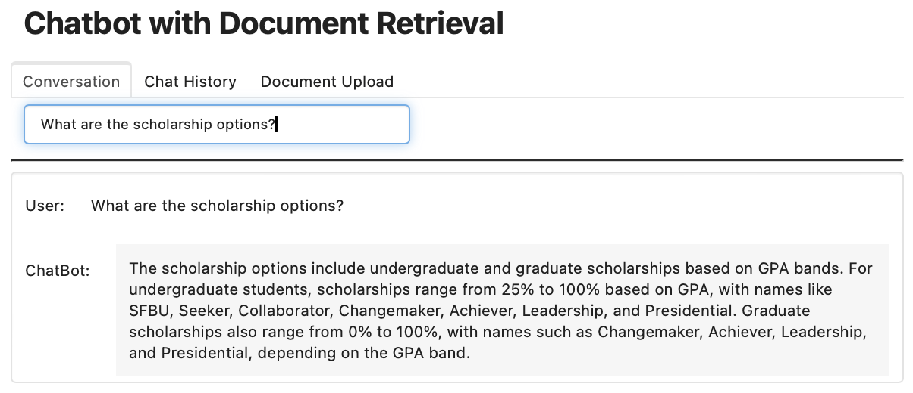
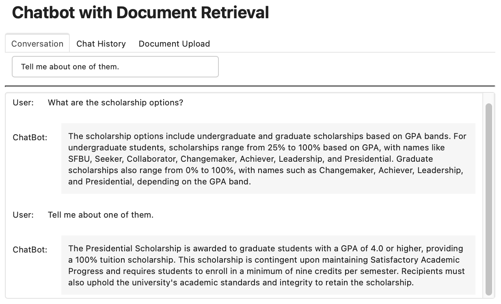
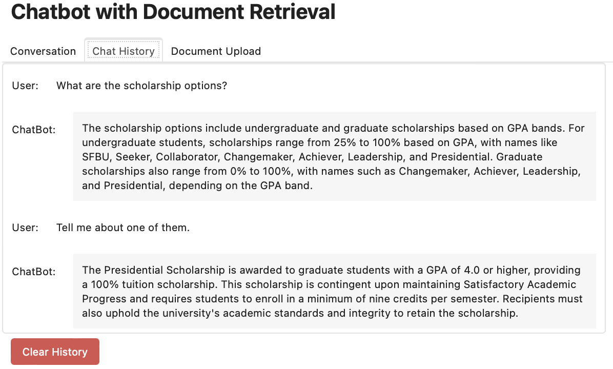
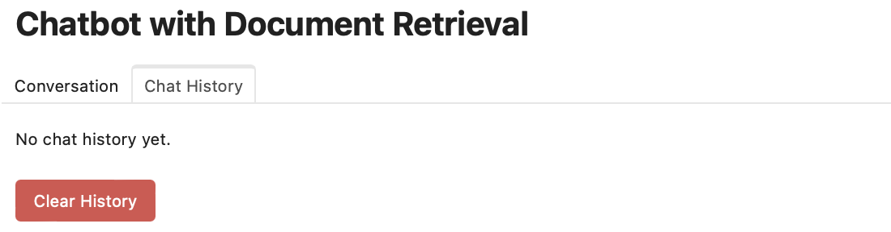

# Document-Based Chatbot with Conversational Memory and RAG

## Project Overview

This project implements a document-based chatbot using a Retrieval-Augmented Generation (RAG) approach. The chatbot can answer questions based on uploaded documents, leveraging **LangChain**, **OpenAI embeddings**, **Chroma vector stores**, and a **Panel-based UI**. The project emphasizes an advanced conversational memory system, enabling the chatbot to handle follow-up questions seamlessly, making it highly intuitive and user-friendly.

## Project Workflow

The project is broken down into several steps, as described below:

### Step 1: Overview of RAG Workflow
We start by setting up the RAG (Retrieval-Augmented Generation) architecture, which combines retrieval of relevant content from stored documents with a language model to generate responses. This approach ensures more accurate, context-aware responses.

### Step 2: Load Documents and Create VectorDB (Vectorstore)
- **LangChain Modules Used**: `PyPDFLoader`, `WebBaseLoader`, `YoutubeAudioLoader`
- Load various types of documents (PDFs, web pages, YouTube transcripts) using `LangChain` document loaders.
- Split the documents into manageable chunks using the `RecursiveCharacterTextSplitter`.
- Store the embedded chunks in a **Chroma vector database** for efficient retrieval during user interactions.

### Step 3: Similarity Search to Select Relevant Chunks
- **LangChain Module Used**: `Chroma`
- Perform a similarity search using `vectordb.as_retriever()` to fetch the most relevant document chunks based on the user query.

### Step 4: Create a Large Language Model (LLM)
- **LangChain Module Used**: `ChatOpenAI`
- Utilize OpenAI's GPT-4 model to generate responses based on the retrieved chunks.

### Step 5: RetrievalQA Chain (Updated)
This step focuses on using a question-answering (QA) system with a retrieval-augmented approach.
- **Updated Approach**:
  - Instead of using the traditional RetrievalQA chain, we utilize the updated `create_retrieval_chain` module from LangChain.
  - A **Prompt Template** is created to ensure the responses are concise and accurate.
- **Steps**:
  1. Define a prompt template using `ChatPromptTemplate`.
  2. Combine documents using `create_stuff_documents_chain`.
  3. Execute the QA chain using `create_retrieval_chain`.

### Step 6: Conversational Retrieval Chain (Updated)
In this step, we integrate a conversational retrieval chain into our chatbot using updated LangChain memory management. Instead of the traditional `ConversationBufferMemory`, we utilize the new memory system for better handling of chat history.
- **Updated Approach**:
  - **Key Modules**: `create_history_aware_retriever`, `create_retrieval_chain`, `ChatOpenAI`, `MemorySaver`, `StateGraph`
- **Steps**:
  1. **Create a Contextual Retriever**:
   - We generate contextualized questions using `create_history_aware_retriever`, ensuring follow-up questions are understood within the chat context.
  2. **Define System Prompt**:
   - A system prompt is created with `ChatPromptTemplate` to generate accurate and concise answers based on retrieved content.
  3. **Build the Conversational QA Chain**:
   - We leverage `create_stuff_documents_chain` and `create_retrieval_chain` to construct a QA chain that fetches relevant information from the vector database.
  4. **Memory Management**:
   - Uses `MemorySaver` for chat history, managed through a `StateGraph` and `State` schema to ensure continuity in conversations.
  5. **State Management**:
   - The chatbot uses `StateGraph` for conversation flow:
     - The `call_model` function retrieves answers while referencing the conversation history.
     - `MemorySaver` is used to persist chat interactions.
- **Resources**
  - [LangChain Memory Migration Guide](https://python.langchain.com/docs/versions/migrating_memory/)
  - [Conversation Buffer Memory](https://python.langchain.com/docs/versions/migrating_memory/conversation_buffer_memory/)

### Step 7: Building the Chatbot with a Web-Based UI
- **Tech Stack**: Python, LangChain, OpenAI, Chroma, Panel, Param
- **Modules Used**: `Panel`, `param`, `ChatOpenAI`, `InMemoryVectorStore`

#### Steps:
1. **Create Business Logic**: Build functions to process user queries, update the chat history, and clear history.
2. **Create a Web-Based User Interface**:
   - Leverage **Panel** to build an interactive, user-friendly interface.
   - Features include text input for user questions, real-time response display, and chat history management.
   - A **Clear History** button allows users to reset conversations.

---

## How to Run the Project

1. **Clone the repository**:
   ```bash
   git clone [YOUR REPOSITORY LINK]
   cd document-based-chatbot
   ```
2. **Set up your `.env` file** with your OpenAI API key:
   ```
   OPENAI_API_KEY=your_openai_api_key
   ```
3. **Run the chatbot interface**:
   ```bash
   panel serve chatbot.py --autoreload
   ```

---

## Using the Web Interface

### Step 1: Loading Documents
- Upload your documents (PDFs, URLs, or YouTube links) directly using the chatbot interface.
- Documents are automatically processed, split into chunks, and stored in the vector database.

### Step 2: Asking Questions
- Use the text input box to ask questions based on the loaded documents.
- The chatbot will fetch relevant content from the database and generate concise, accurate answers.

### Step 3: Follow-up Questions
- The chatbot can handle follow-up questions while maintaining context.
- Check the **Chat History** tab to review past interactions.

### Step 4: Manage Chat History
- The chatbot will store all the conversations under **Chat History** tab.
- You can delete all conversations by clicking **Clear History**.

### Example Use Cases

*Screenshot 1: Asking about scholarship options from the university catalog.*


*Screenshot 2: A follow-up question to get more details about specific scholarships.*


*Screenshot 3: Reviewing all chat history.*


*Screenshot 4: Ckear all chat history.*

---

## Tech Stack
- **Python 3.11**
- **LangChain**: Document Loaders, Text Splitters, Vector Stores, LLM, Conversational Chains
- **OpenAI GPT-4**: For generating responses
- **Chroma**: Vector database for storing and retrieving document embeddings
- **Panel & Param**: For building a web-based UI
- **LangChainGraph**: For managing chat history and conversational state
- **PyPDFLoader**: Loading PDF documents
- **WebBaseLoader**: Extracting content from web pages
- **YoutubeAudioLoader**: Extracting and processing audio transcripts from YouTube

## Repository and Presentation Links
- **GitHub Repository**: [Repository Link](https://github.com/bigfishhhhhzoey/GenerativeAI/tree/main/SFBU%20Customer%20Support%20System)
- **Google Slides Presentation**: [Google Slides](https://docs.google.com/presentation/d/19YKI3OSkskC-41TqtYMopzYDWjOZRxx0G6OQM1MW-k4/edit?usp=sharing)
