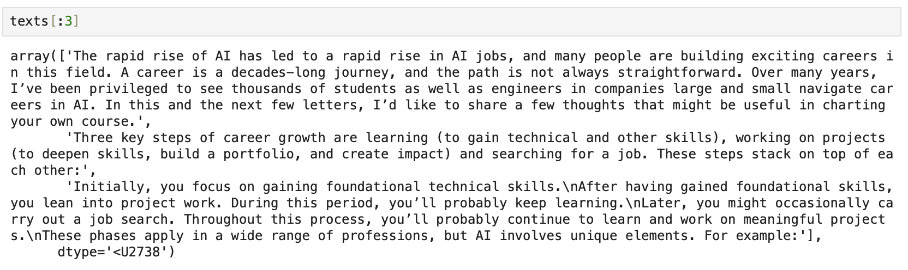
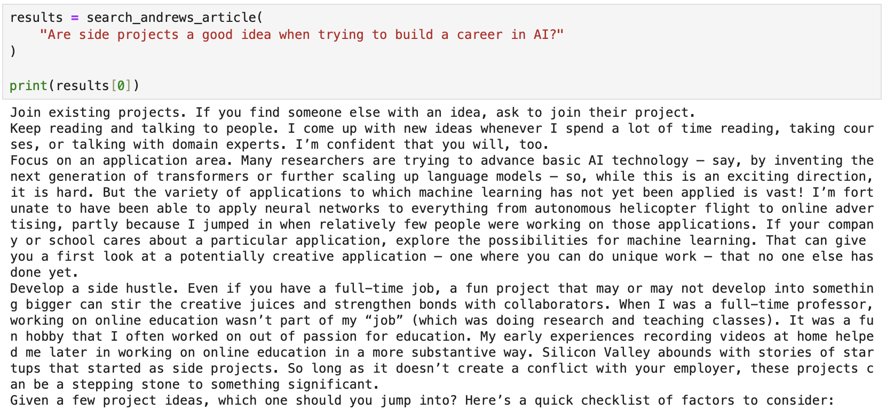
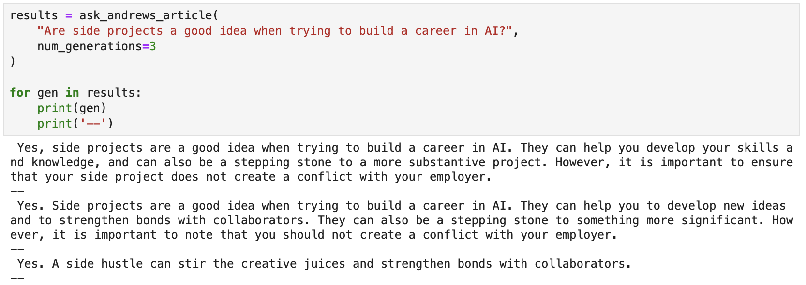

# Generating Answers from Expert Writings Using Search and Large Language Models

This project demonstrates how to build a question-answering system that combines semantic search with a large language model (LLM) to generate answers directly from specific expert writings. The project focuses on using a retrieval-augmented generation (RAG) approach, where a search component is used to retrieve relevant context before generating an answer using a generative model.

## Project Overview
The primary goal of this project is to create an application where users can query an expert's writings and receive specific answers, grounded in the context of those writings. The steps involved include:

1. **Text Archive Preparation**: We start by compiling several articles written by Andrew Ng, specifically on building a career in AI. These articles are used as our text archive for the search.

2. **Chunking and Embedding Text**: The text is split into manageable chunks, and each chunk is embedded using Cohere's embedding API to create vector representations.

3. **Semantic Search Index Creation**: We use Annoy to create a semantic search index of the embedded text. This enables efficient nearest neighbor searches when a query is made.

4. **Question Answering with LLM**: For each query, we first search the text archive for relevant content, and then pass that content along with the original question to a large language model (LLM) from Cohere to generate an accurate and grounded answer.

This approach improves factual accuracy by anchoring the LLM's response in specific content rather than relying solely on pre-trained knowledge, which may be outdated or inaccurate.

## Functions

**1. `search_andrews_article(query)`**

This function takes a question as input, retrieves the most relevant paragraphs from the article archive using semantic search, and returns the most similar results.

**2. `ask_andrews_article(question, num_generations=1)`**

This function takes a question, searches the text archive for relevant paragraphs, and then generates an answer using the Cohere LLM, which is based on the retrieved context.

## Prerequisites
- Cohere API key to generate embeddings and perform text generation.
- Python 3.6+
- Dependencies: Install required Python libraries:
  ```bash
  pip install cohere numpy pandas annoy python-dotenv
  ```

## Example Workflow

### 1. Set Up Environment
- **Get Cohere API Key**: Sign up at [Cohere](https://cohere.ai/) and obtain your API key.
- **Store API keys in `.env` file**:
  ```
  COHERE_API_KEY=your_cohere_api_key_here
  ```

### 2. Load Libraries and Setup API Client
```python
import os
from dotenv import load_dotenv, find_dotenv
load_dotenv(find_dotenv())  # read local .env file
import cohere

co = cohere.Client(os.environ['COHERE_API_KEY'])
```

### 3. Chunk Text and Create Search Index
- **Text Chunking**: Split the articles into paragraphs for better retrieval granularity.
  ```python
  # Split into a list of paragraphs
  texts = text.split('\n\n')
  
  # Clean up to remove empty spaces and new lines
  texts = np.array([t.strip(' \n') for t in texts if t])
  ```
  
  
- **Generate Embeddings**:
  ```python
  co = cohere.Client(os.environ['COHERE_API_KEY'])

  # Get the embeddings
  response = co.embed(
      texts=texts.tolist(),
  ).embeddings
  ```
  
- **Create Search Index**: Build a search index using Annoy.
  ```python
  from annoy import AnnoyIndex
  import numpy as np
  
  embeds = np.array(response)
  search_index = AnnoyIndex(embeds.shape[1], 'angular')
  for i in range(len(embeds)):
      search_index.add_item(i, embeds[i])
  
  search_index.build(10)  # 10 trees
  search_index.save('test.ann')
  ```

### 4. Retrieve Answers from Expert Writings
- **Semantic Search**:
  ```python
  def search_andrews_article(query):
      query_embed = co.embed(texts=[query]).embeddings
      similar_item_ids = search_index.get_nns_by_vector(query_embed[0], 10, include_distances=True)
      return texts[similar_item_ids[0]]
  
  results = search_andrews_article("Are side projects a good idea when trying to build a career in AI?")
  print(results)
  ```
  
  
- **Generate Answer Using LLM**:
  ```python
  def ask_andrews_article(question, num_generations=1):
      results = search_andrews_article(question)
      context = results[0]
      prompt = f"""
      Excerpt from the article titled "How to Build a Career in AI" by Andrew Ng:
      {context}
      Question: {question}
      Extract the answer of the question from the text provided. If the text doesn't contain the answer, reply that the answer is not available.
      """
      
      prediction = co.generate(
          prompt=prompt,
          max_tokens=70,
          model="command-nightly",
          temperature=0.5,
          num_generations=num_generations
      )
      
      return prediction.generations

  results = ask_andrews_article("Are side projects important when you are starting to learn about AI?",
              num_generations=3)
  for gen in results:
      print(gen)
      print('--')
  ```
  
  
## How the Project Works
The workflow consists of two main parts:

1. **Search Step**: When a question is provided, the text archive is searched for the most relevant paragraphs. The semantic search returns relevant content based on the vector representation of the query and text.

2. **Generation Step**: The retrieved paragraphs are combined with the original question in a prompt. This prompt is passed to a generative model, which produces a well-grounded answer.

This two-step process ensures that the response generated is factual, reducing the hallucination problem often seen with LLMs when no context is provided.

## Acknowledgements
This project is inspired by the lesson from the [DeepLearning.AI Semantic Search course](https://learn.deeplearning.ai/courses/large-language-models-semantic-search/lesson/6/generating-answers).

## Repository Link
Access the full codebase on GitHub: [Generative AI QA Project](https://github.com/bigfishhhhhzoey/GenerativeAI/tree/main/Semantic%20Search/Generating%20Answers).

## Google Slides
Check out the presentation for this project: [Generative QA](https://docs.google.com/presentation/d/1N6ih9kCUdX-OL7ANvAu1AKfYUUsUU93OLLAvJmi9A0g/edit?usp=sharing).

