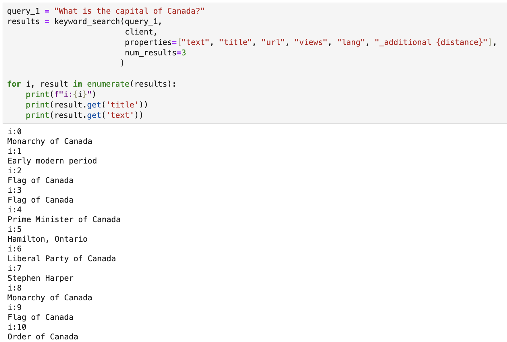
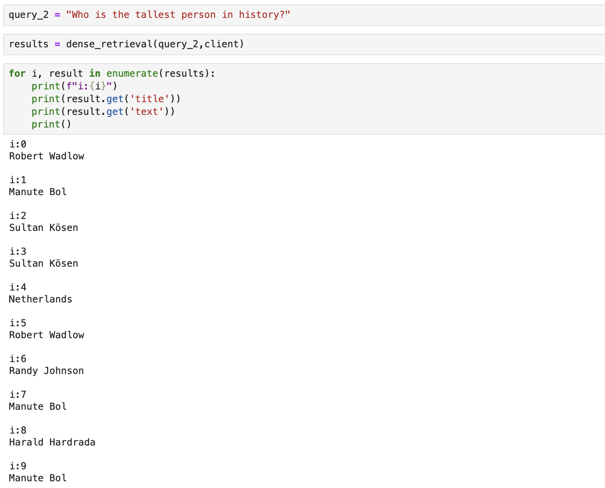
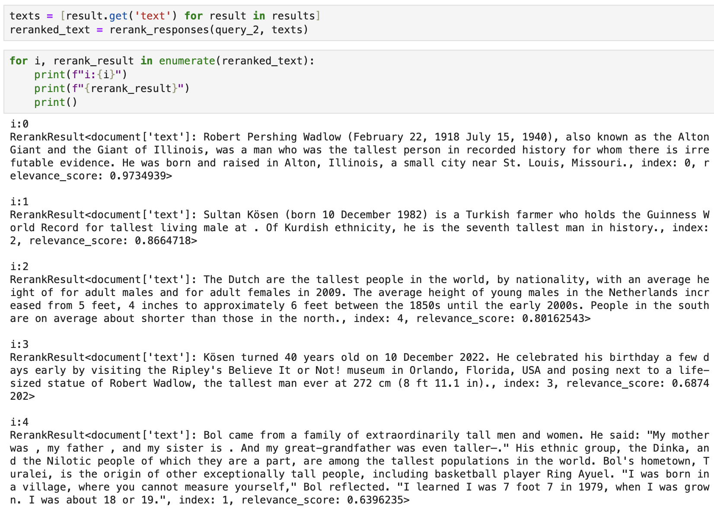

# Semantic Search with Keyword, Dense Retrieval, and Rerank

This project demonstrates how to implement semantic search by combining keyword-based search, dense retrieval techniques, and reranking, utilizing BM25, transformer-based embeddings, and relevance scoring to retrieve and rank relevant documents. The core of the project focuses on leveraging Weaviate's client API for building a semantic search engine that ranks articles effectively based on user queries.

## Project Overview
The project provides three main components for retrieval and ranking:

1. **Keyword Search**: Uses BM25 to perform a keyword-based search that matches the terms from the query against articles in the dataset. This approach provides a good starting point but may not always yield the most relevant results.

2. **Dense Retrieval**: Uses dense embeddings to identify articles similar to the query conceptually, even if the exact terms are not present. This method helps find documents that are semantically related to the query, but the results may still include irrelevant or noisy responses.

3. **Rerank**: After retrieving initial results using keyword search or dense retrieval, Rerank is used to sort the search results based on their relevance to the query. This step significantly improves the quality of the results by assigning a relevance score to each retrieved document and sorting them from most to least relevant. Rerank ensures that the final results presented are accurate and directly answer the user's query.

The project also includes a function to print the search results in a readable format with colorful formatting.

## Prerequisites
- Cohere and Weaviate API keys are required for this project. These keys allow access to the Cohere and Weaviate services needed for semantic search.
- The project retrieves data from a public Weaviate demo database: [https://cohere-demo.weaviate.network/](https://cohere-demo.weaviate.network/), which contains Wikipedia entries.
- Python 3.6+
- Weaviate client library (`weaviate-client`) to connect to the semantic search backend
- Weaviate instance to run the semantic search

## Usage
The following functions are included in the code:

### 1. `keyword_search(query, client, results_lang='en', properties, num_results)`
This function performs keyword-based search using BM25. It takes the following parameters:
- **query**: The search string
- **client**: Weaviate client instance to connect to the backend
- **results_lang**: Language of the results (default is 'en')
- **properties**: List of properties to include in the search results
- **num_results**: Number of search results to retrieve (default is 3)

### 2. `dense_retrieval(query, client, results_lang='en', properties, num_results)`
This function performs a dense retrieval by utilizing transformer-based embeddings to capture the semantic meaning of the query. Parameters are similar to `keyword_search`.

### 3. `rerank_responses(query, responses, num_responses)`
This function reranks the retrieved results based on their relevance to the query. It assigns a relevance score to each query-response pair and sorts the results accordingly, ensuring that the most relevant answers are ranked higher.

### 4. `print_result(result)`
This function prints the retrieved articles with colorful formatting for better readability. Each property of the search result is displayed clearly.

## Example Workflow
To use this project for semantic search:
1. **Set up Environment**:
   - Get Cohere API Key: Sign up at [Cohere](https://cohere.ai/) and obtain your API key.
   - Get Weaviate API Key: You can access the public Weaviate demo instance without a key or set up your own Weaviate instance and use the corresponding API key.
   - Store your API keys in a configuration file (`.env`) in this format:
    ```
    COHERE_API_KEY=your_cohere_api_key_here
    WEAVIATE_API_KEY=your_weaviate_api_key_here
    ```
   
2. **Initialize the Weaviate client**:
   ```python
   import weaviate
   client = weaviate.Client()
   ```

3. **Perform keyword-based or dense retrieval search**:
   ```python
   query = "What is the capital of Canada?"
   # Using keyword search as example
   results = keyword_search(query_1,
                         client,
                         properties=["text", "title", "url", "views", "lang", "_additional {distance}"],
                         num_results=3
                        )

   for i, result in enumerate(results):
       print(f"i:{i}")
       print(result.get('title'))
       print(result.get('text'))
   ```

4. **Rerank the results**:
   ```python
   texts = [result.get('text') for result in results]
   reranked_text = rerank_responses(query_1, texts)

   for i, rerank_result in enumerate(reranked_text):
       print(f"i:{i}")
       print(f"{rerank_result}")
       print()
   ```

## How Rerank Improves Search Results
The Rerank component plays a crucial role in enhancing the accuracy of search results. While keyword search and dense retrieval provide a good set of potential matches, these methods may still return irrelevant or incorrect results. Rerank addresses this limitation by assigning a relevance score to each retrieved document and sorting them accordingly.

### Key Word Search Results:
- **Before Rerank:**
Keyword search often retrieves documents that contain the exact terms from the query but may not be contextually relevant.


- **After Rerank:**
Rerank helps to ensure that the correct answer is at the top by assigning higher scores to the most relevant responses. 


### Dense Retrieval Results:
- **Before Rerank:**
Dense retrieval retrieves semantically similar responses, but not all of them are relevant to the query. In this case, some responses are incorrect or off-topic.


- **After Rerank:**
Rerank helps to ensure that the correct answer is at the top by assigning higher scores to the most relevant responses. 


## Acknowledgements
This project is inspired by the lesson from the [DeepLearning.AI Semantic Search course](https://learn.deeplearning.ai/courses/large-language-models-semantic-search/lesson/5/rerank).

## Repository Link
You can access the full codebase on GitHub: [Semantic Search/Rerank](https://github.com/bigfishhhhhzoey/GenerativeAI/tree/main/Semantic%20Search/Rerank).

## Google Slides
You can access the presentation on Google Slides: [Semantic Search with Rerank](https://docs.google.com/presentation/d/1egA18GALoF8M55py6dfLz_GY61fkFyQw-_lgUVyptbY/edit?usp=sharing).
