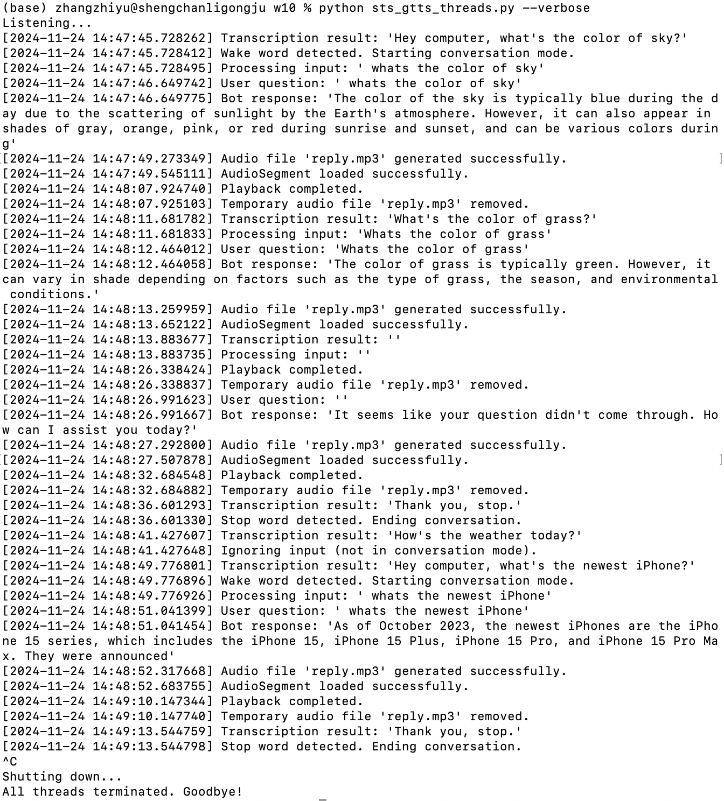
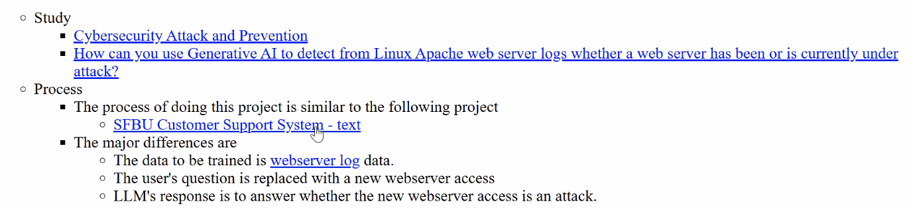
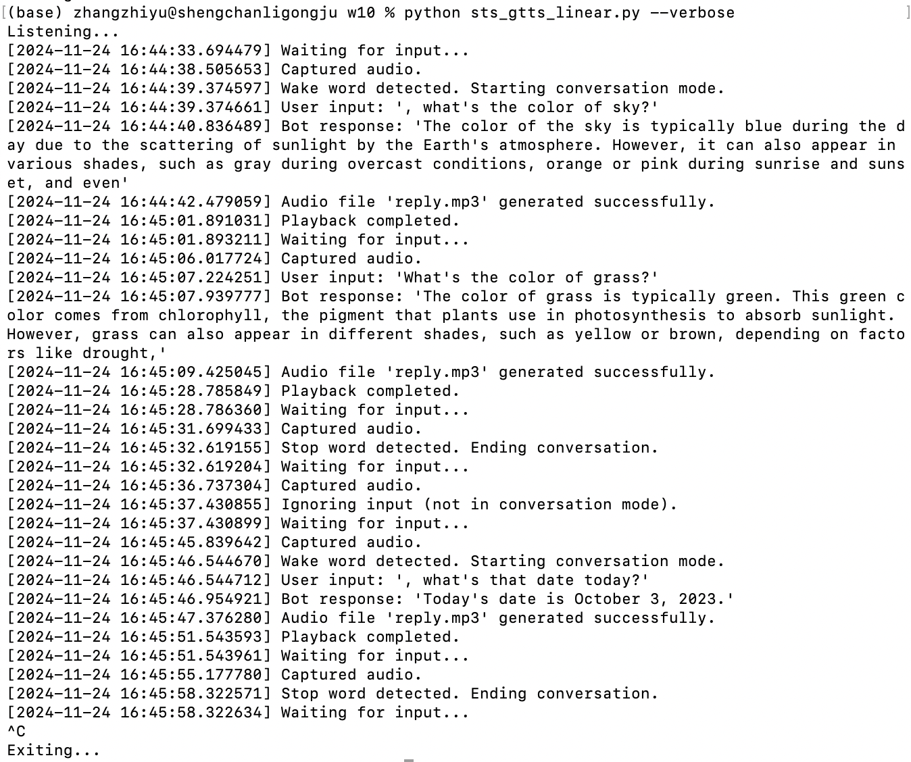

# **Voice Assistant Project with GPT-4, Whisper API, and Google TTS**

## **Overview**
This project is a voice assistant program that integrates OpenAI’s **GPT-4o-mini** for text generation, **Whisper API** for speech-to-text transcription, and Google’s **gTTS** for text-to-speech (TTS). The assistant takes audio input from the user, processes it using AI models, generates responses, and outputs the responses via audio playback. It’s designed to support natural and conversational interactions, with features like wake words, stop words, and graceful shutdowns.


## **Features**
1. **State-of-the-Art AI Models**:
   - **GPT-4o-mini**: Selected for its balance between **cost efficiency** and **performance**. Integration uses the **`get_completion()`** function, designed for the newest OpenAI chat model structure with `role` and `content`.
   - **Whisper API**: Provides accurate speech-to-text transcription, replacing older Whisper model calls for efficiency and simplicity.
   - **Google gTTS**: Converts responses into natural-sounding audio.

2. **Conversational Design**:
   - Wake word (default: "hey computer") to start interactions.
   - Stop word (default: "stop") to end conversations without restarting the program.

3. **Playback Blocking**:
   - Prevents the microphone from picking up audio playback during response output, ensuring clean and accurate interactions.

4. **Silent Input Handling**:
   - The bot ignores silent periods without logging unnecessary timeout messages.

5. **Modes of Execution**:
   - **Threaded Mode**:
     - Supports simultaneous recording, transcription, and response generation, enabling real-time conversation flow.
   - **Linear Mode**:
     - Processes tasks sequentially to prevent any potential audio feedback issues, ideal for environments with external speakers.

6. **Dynamic Logging**:
   - **Verbose mode** provides detailed logs for debugging, including timestamps and intermediate steps.
   - **Default mode** outputs only user questions and bot responses for a clean user experience.

7. **Graceful Shutdown and Restart**:
   - Uses `initialize_flags()` to reset shared resources (threads and queues) for clean restarts after abrupt terminations.


## **Core Functions**

### 1. **`record_audio()`**
Handles capturing audio from the microphone.
- **Inputs**:
  - Records using the `speech_recognition` library.
  - Adjusts thresholds dynamically for energy levels and pauses.
- **Outputs**:
  - Puts raw audio data into the shared `audio_queue`.
- **Additional Features**:
  - Ignores silent periods to avoid unnecessary processing.
  - Provides timeout handling to prevent indefinite blocking.

### 2. **`transcribe_forever()`**
Processes audio and converts it to text using the Whisper API.
- **Inputs**:
  - Reads audio data from the `audio_queue`.
  - Handles wake words and stop words for conversational control.
- **Outputs**:
  - Transcribed text is pushed into the `result_queue` for response generation.
- **Special Features**:
  - Supports conversational flow without requiring repeated wake words.
  - Detects stop word for session control.

### 3. **`reply()`**
Generates responses using GPT-4o-mini and outputs them via TTS.
- **Inputs**:
  - Reads transcribed text from the `result_queue`.
- **Outputs**:
  - Sends responses to the user as both text (in logs) and audio (via gTTS).
- **Additional Features**:
  - Uses a cache for repeated questions to reduce API calls.
  - Blocks playback to avoid audio feedback.

### 4. **`get_completion()`**
A utility function to generate responses using the OpenAI GPT API.
- Implements the latest OpenAI chat model structure with `role` and `content`.
- Customizable parameters such as temperature and maximum token limit.


## **Directory Structure**
```plaintext
GTTS/
├── sts_gtts_linear.py    # Linear mode implementation for environments prone to feedback.
├── sts_gtts_threads.py   # Threaded mode implementation for simultaneous processing.
├── test_audio.py         # Utility to test audio input functionality.
├── test_speech.py        # Utility to test speech transcription and response generation.
```

### **Using the Files**
1. **Testing Utilities**:
   - `test_audio.py`: Test microphone and audio recording functionality.
     ```bash
     python test_audio.py
     ```
   - `test_speech.py`: Test Whisper API and GPT integration.
     ```bash
     python test_speech.py
     ```

2. **Threaded Mode**:
   Run `sts_gtts_threads.py` for simultaneous recording, transcription, and reply:
   ```bash
   python sts_gtts_threads.py --verbose
   ```
   Use this mode for faster response times when audio feedback is not an issue.

3. **Linear Mode**:
   Run `sts_gtts_linear.py` for sequential processing:
   ```bash
   python sts_gtts_linear.py
   ```
   Use this mode in environments with external speakers to prevent playback feedback.


## **Sample Use Cases**
Below are some common use cases and examples of interaction with the assistant:

1. **Threaded Mode**
   - **Verbose Mode**:
   All detailed logs are displayed, including timestamps, intermediate steps, transcription results, and playback processes. The test includes the following:
     - **Use wake word**: The user starts the conversation by saying "Hey computer."
     - **Ask questions**: Questions like "What's the color of the sky?" and "What's the color of grass?" are asked, with detailed responses from the bot.
     - **Maintain conversation**: The program continues listening and responding without needing the wake word again.
     - **Use stop word**: The user says "Thank you, stop." to temporarily end the conversation.
     - **Ignore input when not in conversation mode**: The bot does not process questions unless the conversation is reactivated.
     - **Start conversation again**: The user says the wake word and asks another question, "What's the newest iPhone?" to restart the session.
     - **End conversation and exit**: The user says "Thank you, stop." to end the conversation and exits the program with `Ctrl+C`.  
   
      
   - **Default Mode**:
   Only the user’s question and the bot’s response are printed for a cleaner display. This mode is more user-friendly and focused on providing a streamlined experience for real-world use cases.
   

2. **Linear Mode**
   


## **Reflection and Drawbacks**

### **Benefits of Threads**
- Threads allow the assistant to perform **recording**, **transcription**, and **response generation** simultaneously:
  - The bot can listen while it is speaking, allowing users to interrupt playback with new input.
  - This improves the natural flow of conversation and reduces response latency.

### **Challenges**
1. **Audio Feedback with External Speakers**:
   - If the microphone is sensitive and external speakers are used, the bot might pick up its own playback when interrupted by new input.
   - Blocking playback minimizes this issue but does not eliminate it entirely in all environments.

2. **Complexity of Thread Management**:
   - Requires careful synchronization of resources (e.g., queues, shutdown events) to avoid thread-related bugs.
   - A linear implementation is simpler but sacrifices the ability to listen while speaking.

### **Trade-off**
This project provides both **threaded** and **linear** modes to address different use cases:
- Use **threaded mode** for conversational speed and real-time interactions.
- Use **linear mode** for environments where audio feedback is a concern.


## **Conclusion**
This voice assistant combines cutting-edge AI models (GPT-4o-mini and Whisper API) with robust engineering to deliver a conversational, natural, and efficient experience. With flexibility for different environments and use cases, it is a versatile tool for exploring voice-based AI interactions.


## Repository Link
You can access the full codebase on GitHub: [Speech-Text-Speech/GTTS](https://github.com/bigfishhhhhzoey/GenerativeAI/tree/main/Speech-Text-Speech/GTTS).


## Google Slides
You can access the presentation on Google Slides: [Speech-Text-Speech/GTTS](https://docs.google.com/presentation/d/1eskt9ta_DZ8QCKdt1S9Ht7wlaMVi7rPWJhT1OxlwI9E/edit?usp=sharing).
