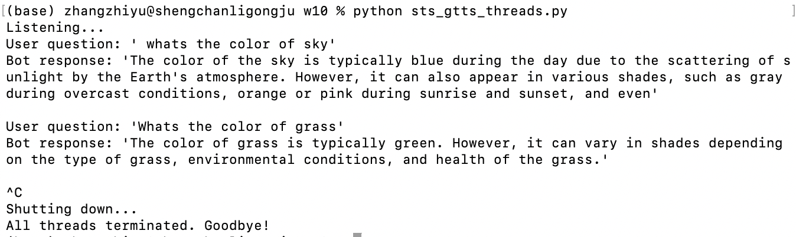

# **Voice Assistant Project with GPT-4, Whisper API, and Google TTS**

## **Overview**
This project is a voice assistant program that integrates OpenAI’s **GPT-4o-mini** for text generation, **Whisper API** for speech-to-text transcription, and Google’s **gTTS** for text-to-speech (TTS). The assistant takes audio input from the user, processes it using AI models, generates responses, and outputs the responses via audio playback. It’s designed to support natural and conversational interactions, with features like wake words, stop words, and graceful shutdowns.

## **Features**
1. **AI-Powered Conversations**:
   - **GPT-4o-mini** is used for generating responses, offering a balance between performance and cost.
   - Designed for conversational use, so users don’t need to repeat the wake word for every query in an ongoing session.

2. **Accurate Speech-to-Text**:
   - OpenAI’s **Whisper API** is used for speech transcription, ensuring high accuracy and efficiency.
   - Transcribed text is cleaned up and seamlessly passed to downstream functions for response generation.

3. **Natural Text-to-Speech**:
   - Google’s **gTTS** generates audio responses in clear, natural-sounding English, which are played back to the user.

4. **Flexible Controls**:
   - **Wake word** (default: "hey computer") to initiate conversations.
   - **Stop word** (default: "stop") to end conversations without restarting the program.
   - **Shutdown word** (default: "goodbye") to terminate the program gracefully.

5. **Playback Blocking**:
   - Ensures that the bot doesn’t pick up its own audio output during playback, even when used with external speakers.

6. **Graceful Shutdown**:
   - Cleanly shuts down all threads, ensuring no residual processes remain when the program ends.
   - Works via audio shutdown commands or manual keyboard interrupts (`Ctrl+C`).

7. **Improved Logging**:
   - **Verbose Mode**:
     - Provides detailed logs, including timestamps, transcription results, user queries, and bot responses.
   - **Default Mode**:
     - Only prints user questions and bot answers for concise output.

8. **Thread Management**:
   - Threads allow simultaneous recording, transcription, and response generation, enabling the bot to listen while it speaks.
   - A dedicated `initialize_flags()` function ensures proper reinitialization of threads and shared resources for clean restarts.

9. **Silent Input Handling**:
   - The bot ignores silent periods without logging unnecessary timeout messages.

## **Improvements Made**
1. **Enhanced AI Integration**:
   - Transitioned to the **GPT-4o-mini** model, balancing cost efficiency with high performance.
   - Updated to the latest OpenAI API message structure for compatibility and functionality.

2. **Whisper API Utilization**:
   - Replaced direct Whisper model calls with the more efficient and updated **Whisper API**.
   - Adjusted the transcription output format for seamless integration with downstream processing.

3. **Conversational Flow**:
   - Users can interact naturally without repeating the wake word before every query.
   - Stop and shutdown words provide intuitive control over the session.

4. **Playback Blocking**:
   - Ensures the bot doesn’t respond to its own audio output during playback, especially when using external speakers.

5. **Graceful Restart Mechanism**:
   - Added `initialize_flags()` to ensure proper thread and resource reinitialization after abrupt terminations.
   - Prevents issues like starting in non-conversational mode or failing to process inputs after restarts.

6. **Dynamic Output Control**:
   - Verbose mode offers detailed logs for debugging.
   - Default mode provides clean and user-friendly output by printing only the user question and bot response.

## **Sample Use Cases**
Below are some common use cases and examples of interaction with the assistant:

1. **Verbose Mode**:
   
      
2. **Default Mode**:
   

## **Reflection and Drawbacks**

### **Benefits of Threads**
- Threads allow the assistant to perform **recording**, **transcription**, and **response generation** simultaneously:
  - The bot can listen while it is speaking, allowing users to interrupt playback with new input.
  - This improves the natural flow of conversation and reduces response latency.

### **Drawbacks of Threads**
1. **Audio Feedback with External Speakers**:
   - If external speakers are used, the bot may pick up its own output during playback, especially when a user tries to interrupt with new input.
   - Playback blocking minimizes this issue but doesn’t fully eliminate it in some environments.

2. **Increased Complexity**:
   - Threads require careful synchronization and resource management (e.g., queues, shutdown events).
   - Mismanagement can lead to issues like thread starvation or race conditions.

### **Trade-Off**
- While a **linear implementation** avoids playback feedback issues, it sacrifices the multi-threading benefits of simultaneous task handling.
- This threaded version is ideal for scenarios where users may interrupt the bot during playback, provided external microphones or headsets are used to avoid feedback.

---

## **Conclusion**
This voice assistant program combines state-of-the-art AI models with practical design considerations to deliver a robust, natural, and intuitive user experience. It handles real-time conversations gracefully, manages threads efficiently, and offers flexible control for users. The inclusion of both threaded and linear designs ensures adaptability for various environments and use cases.
