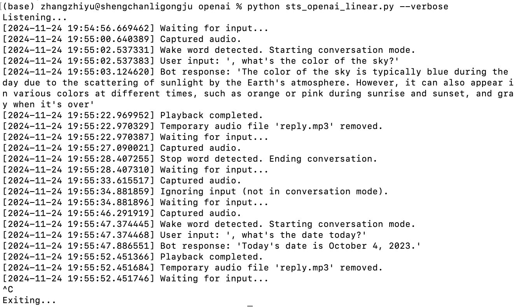

# Voice Assistant Project with GPT-4, Whisper API, and OpenAI TTS

## Overview
This project is an advanced version of the [GTTS-based voice assistant](https://github.com/bigfishhhhhzoey/GenerativeAI/tree/main/Speech-Text-Speech/GTTS) with several key improvements. It integrates OpenAI’s **GPT-4o-mini** for text generation, **Whisper API** for speech-to-text transcription, and OpenAI's **TTS API** for text-to-speech. The assistant takes audio input, processes it using AI models, generates responses, and outputs responses via natural-sounding audio playback. 

The program supports both **threaded** and **linear** modes to address different use cases, enhancing conversational flow and reducing playback feedback issues.


## Features
1. **State-of-the-Art AI Models**:
   - **GPT-4o-mini**: Selected for a balance between cost efficiency and performance.
   - **Whisper API**: Replaces older Whisper model calls for improved speech-to-text efficiency.
   - **OpenAI TTS**: Provides high-quality, natural-sounding speech with customizable voices.

2. **Improved Conversational Design**:
   - Wake word (default: "hey computer") to start interactions.
   - Stop word (default: "stop") to end conversations temporarily.
   
3. **Playback Blocking**:
   - Prevents the microphone from picking up playback, ensuring clean and accurate responses.

4. **Modes of Execution**:
   - **Threaded Mode**:
     - Simultaneously records, transcribes, and generates responses for real-time interactions.
   - **Linear Mode**:
     - Processes sequentially, ideal for environments prone to audio feedback.

5. **Dynamic Logging**:
   - **Verbose Mode**: Provides detailed logs, including timestamps and intermediate steps.
   - **Default Mode**: Outputs only user questions and bot responses for clean interactions.

6. **Graceful Shutdown and Resource Management**:
   - Uses `initialize_flags()` and `clear_queue()` to ensure proper resource cleanup during shutdown or restart, enhancing reliability compared to the previous GTTS-based implementation.

7. **Reference to GTTS Project**:
   - Builds on the foundation of the [GTTS-based voice assistant project](https://github.com/bigfishhhhhzoey/GenerativeAI/tree/main/Speech-Text-Speech/GTTS) with new features like OpenAI TTS, improved conversational flow, and advanced error handling.


## Core Functions

1. **`record_audio()`**:
   - Captures audio input using the `speech_recognition` library.
   - Dynamically adjusts energy thresholds and pauses to optimize detection.

2. **`transcribe_forever()`**:
   - Converts audio input to text using the Whisper API.
   - Handles wake words, stop words, and conversation management.

3. **`reply()`**:
   - Generates responses using GPT-4o-mini and converts them to speech using OpenAI TTS.
   - Features playback blocking to prevent audio feedback.

4. **`get_completion()`**:
   - Simplifies GPT-4 API integration using the latest message structure.


## Directory Structure
```plaintext
OpenAI_TTS/
├── sts_openai_threads.py    # Threaded mode implementation for simultaneous processing.
├── sts_openai_linear.py     # Linear mode implementation for sequential processing.
├── test_audio.py            # Utility to test microphone functionality.
├── test_speech.py           # Utility to test Whisper API and GPT integration.
```

---

## Usage Instructions
1. **Testing Utilities**:
   - [`test_audio.py`](https://github.com/bigfishhhhhzoey/GenerativeAI/blob/main/Speech-Text-Speech/OpenAI%20TTS/test_audio.py): Test microphone and audio recording functionality.
     ```bash
     python test_audio.py
     ```
   - [`test_speech_openai.py`](https://github.com/bigfishhhhhzoey/GenerativeAI/blob/main/Speech-Text-Speech/OpenAI%20TTS/test_speech_openai.py): Test Whisper API and OpenAI TTS integration.
     ```bash
     python test_speech.py
     ```

2. **Threaded Mode**:
   Run [`sts_openai_threads.py`](https://github.com/bigfishhhhhzoey/GenerativeAI/blob/main/Speech-Text-Speech/OpenAI%20TTS/sts_openai_threads.py) for simultaneous processing:
   ```bash
   python sts_openai_threads.py
   ```

   - To enable verbose mode for detailed logs:
     ```bash
     python sts_openai_threads.py --verbose
     ```

2. **Linear Mode**:
   Run [`sts_openai_linear.py`](https://github.com/bigfishhhhhzoey/GenerativeAI/blob/main/Speech-Text-Speech/OpenAI%20TTS/sts_openai_linear.py) for sequential processing:
   ```bash
   python sts_openai_linear.py
   ```

   - To enable verbose mode:
     ```bash
     python sts_openai_linear.py --verbose
     ```


## Sample Use Cases

### Threaded Mode
1. **Verbose Mode**:
   - Demonstrates detailed logs, including transcription results, bot responses, and playback status.
   - Covers use cases like:
     - Starting a conversation with the wake word.
     - Maintaining conversation flow.
     - Using the stop word to end the conversation.
     - Interrupting playback with the interrupt word.
     - Gracefully shutting down the program.

   

2. **Default Mode**:
   - Displays only user questions and bot responses for clean and concise interactions.

   

### Linear Mode
1. **Verbose Mode**
   

2. **Default Mode**
   

   
## Reflection and Drawbacks

### Benefits of OpenAI TTS
- **Enhanced Audio Quality**: OpenAI's TTS produces more natural and professional-sounding speech compared to GTTS.
- **Custom Voices**: Allows for voice customization, e.g., "shimmer."

### Challenges
1. **Playback Delay**:
   - Using OpenAI TTS introduces slight delays in generating and streaming audio compared to GTTS.
   - This delay is due to the streaming process and API call latency.

2. **Thread Complexity**:
   - The threaded mode offers real-time interaction but increases the risk of audio feedback in environments with external speakers.
   - The linear mode is simpler but sacrifices real-time conversation flow.


## Repository Link
Access the full codebase on GitHub: [Speech-Text-Speech/OpenAI TTS](https://github.com/bigfishhhhhzoey/GenerativeAI/tree/main/Speech-Text-Speech/OpenAI%20TTS).

## Google Slides
You can access the presentation on Google Slides: [Voice Assistance Bot with OpenAI TTS](https://docs.google.com/presentation/d/1_cEa_AHGAoq9JSgTAJcMCuAt1plvvPOo9zzJpCWdClY/edit?usp=sharing).
